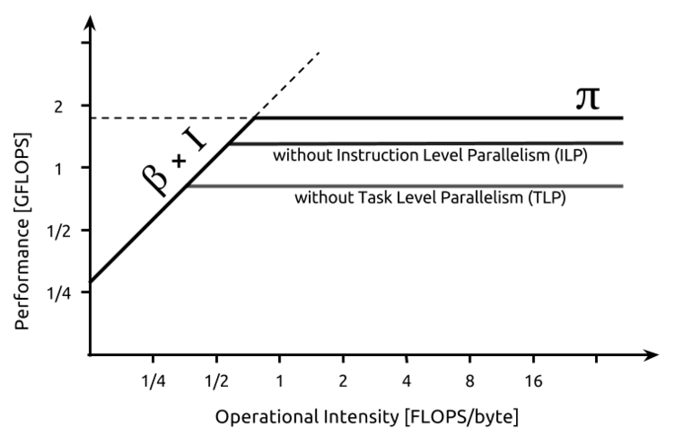

# 当RTL与模拟器结果相悖时，应该相信谁？

如果是在微架构迭代过程中，我的答案是RTL和微架构模拟器都不值得相信。
我更倾向于相信 first order model。
因为微架构模拟器可能存在实现bug，RTL更容易存在实现bug。
事实上，我遇到过这种情况：一个特性在RTL和微架构模拟器上都无法获得收益，
最后发现是二者在同一个地方存在同样的配置瓶颈。

# 什么是first order model？

我在 Tony Nowatzki 的论文[Architectural Simulators Considered Harmful](https://ieeexplore.ieee.org/document/7155440)里
首次接触到 first order model VS. detailed model 的对比。
该论文对 first order model 的定义较为宽泛：
> Another alternative is first-order models.
> This categorizes a broad range of techniques, which can include trace-driven simulators,
> analytical models, mathematical proofs, or even event-driven simulators to some extent.
数学上的[first order approximation](https://en.wikipedia.org/wiki/Order_of_approximation)则更加狭窄：
指用一个线性函数近似描述一个复杂的函数。

本文主要讨论的是analytical model，尤其是线性的、基于 events 统计的 analytical model，
也是在《量化研究方法》中最常用的那一套分析方法。

一个为大家所熟知的 first order model 是 [roofline model](https://en.wikipedia.org/wiki/Roofline_model)。
Roofline model 告诉大家：当一个应用的计算访存比大于一定阈值时，它的性能上限取决于峰值计算吞吐；
否则，它的性能上限取决于访存带宽。
如下图所示，通过提高硬件或者软件ILP或TLP，可以提高系统的峰值计算吞吐，优化受限于计算的应用。

再例如，当缓存MPKI是10时，CPI是1.0，memory stall 在 topdown 的 CPI stack中占比为20%。
问缓存MPKI减半，性能可以提升多少？
最简单的 first order analytical model 就是用 memory stall CPI 乘 50% 替换原来的 memory stall CPI，
得到新的 CPI=0.9。
这个模型忽略了很多细节，例如被消减的 cache miss 是否可以并行化的，会引入一定误差，
但是足以帮助我们得到一个大概的性能范围了。

# 如何使用first order model？

Naively，我们对 first order model 的常见使用方法就类似于上面讲cache miss和CPI之间的关系的例子。
具体地，我们可以用ISA 模拟器或者微架构模拟器统计可供优化的事件出现的次数（$EventCount$），
和优化后该事件可以减少的周期数($CycleOpt$)。
从而计算出优化后的周期数：
$$Cycle_{new}=Cycle_{old} - EventCount \times CycleOpt$$
如果同一时刻可能同时存在多个该类型的事件，即存在并行度（$parallelism$），那么可以再加上一个并行度修正：
$$Cycle_{new}=Cycle_{old} - EventCount \times CycleOpt \div parallelism $$

# 把uncalibrated detailed model视为first order model

在学生时代，或者资源不足的公司里，会遇到复杂的RTL没有经对齐的模拟器的情况。
这时候，有两种较为极端的观点：
1. 一定要严格地对齐模拟器，将模拟器和RTL的每一个误差指标降低到x%以内。
2. 模拟器不对齐也可以用，只需要看一个趋势即可。

其中，第二种观点在Tony的论文里已经被喷烂了，本文不再鞭尸。
第一种观点的话，我听说某大厂干过，给几个月时间让1-2个人把开源的GEM5对齐到一个高度成熟的core，
要求性能误差在10%以内。
个人认为，如果公司人力够，比如给3-5人\*年的人力成本，是可以先进行较为严格的对齐，再进行架构探索。
如果给不到的话，个人建议还是别接这个锅。

话说回来，如果给不到这么多人力，该怎么办？我个人的做法是**把uncalibrated detailed model视为first order model**。
具体地讲，就是用微架构模拟器研究**程序的内在特性**和**算法的实现无关性质**。

# First order model不适用于什么情况？
