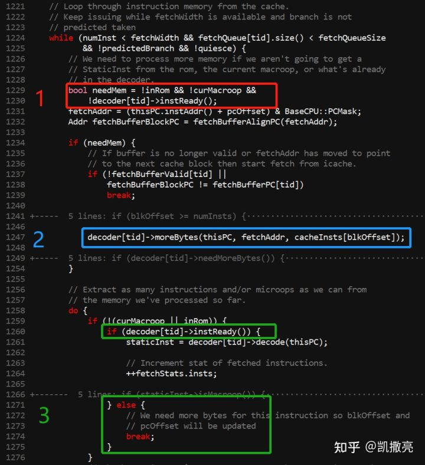
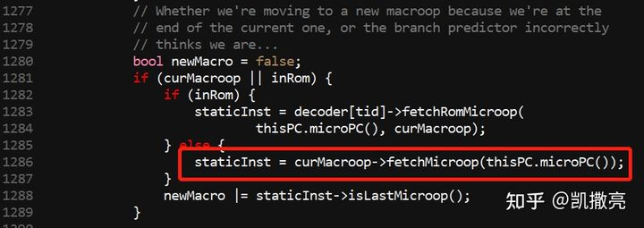

# GEM5 O3是指令集无关的，那么它如何处理不定长指令？

本文不是科普向，面向的是体系结构方向的研究生、GEM5的（开发性质的）用户。

本文希望回答以下问题：

1. **总所周知，GEM5的处理器核微结构模拟的基本上做到了指令集无关，那么在O3 CPU中取指的时候是如何处理不定长指令的呢？例如，定长的MIPS，压缩的RVC，完全不定长的X86。**
2. **如何处理一个macro op (mop) 生成多个micro op (uop) 的情况？**

什么样的同学需要知道这两个问题的答案？比如当某人需要给GEM5加一个trace cache，或者把frontend改成decouple  style的时候，如果不弄清楚的话，可能会踩大坑。因为他大概率需要复用GEM5的decoder的功能，而不搞清楚这两个问题也就没有搞清楚GEM5的decoder的接口，这是非常危险的。

如果读者还不知道两个问题的答案，想最大化自己的收获，那么建议直接去读源码——如果是一个需要改代码的人，看文章的收获肯定不如看源码。

下面开始回答：

因为我可能会提到代码行数，为了行数避免对不上，这里说明一下我使用的commit是开发者分支的`28f8a39726f6c94c28f06147a2846274a416d5a7 ` 

下面是fetch_impl.hh的核心循环：

首先，蓝框2这里（1247行）告诉了我们GEM5如何知道指令的长度。GEM5的decode实际上是在fetch这里做到，所以他可以判断出指令的长度（所以O3的decode phase基本上是个空壳）。实际的处理器实现的时候会对指令进行预译码（例如Boom），也可以获得相似的信息。

然后，变长指令是怎么处理的？fetch是不是也要喂给decoder变长的指令？不是。还是看框2这里，fetch喂给decoder的总是对齐的定长的指令（经常是4个byte，即一个word）。

最后，1) 当一次喂进去的word不够的时候，是如何处理的？2) 当一次喂进去的一个word可以生成多个uop，是如何处理的？

1) 看绿框3这里，1260行，当当前word不足以生成一条新的指令时，`decoder[tid]->instReady()`会返回false，然后从1274跳出**内层**循环，然后继续执行外层循环。此时needMem会是`true`，然后蓝框2这里再继续喂新的word给decoder。如此循环，直到喂进去的payload足以生成新的指令。

2)  分两种情况，第一是一个word里面包含了多条指令，例如2个RVC指令；第二是生成的一条指令需要用多个uop实现，例如（开发者分支中的）RVA的原子指令实现。第一种情况由decorder负责：如果一个word里面包含了多条指令，下一次外层循环的1230行的`decoder[tid]->instReady()`会返回`true` ，导致fetch不给decoder喂新的payload，decoder会用上次喂进去的payload继续翻译。第二种情况由fetch这里负责，直接从上一个mop中继续生成uop：

fetch这里的关键就在于decoder接口的行为：

- `instReady()`的含义：1. 字面意义：指令就绪；2. 不再需要更多的指令payload 
- `moreBytes`(...)：总是吃进去对齐的指令 ，基本上等于是`moreWord` 

Takeaways：当我们需要魔改fetch的时候

- 如果`instReady()`为真，就别继续喂了，会撑出问题
- 喂给`moreBytes`(...) 对齐的指令就行了，不用操心RVC这样的变长指令