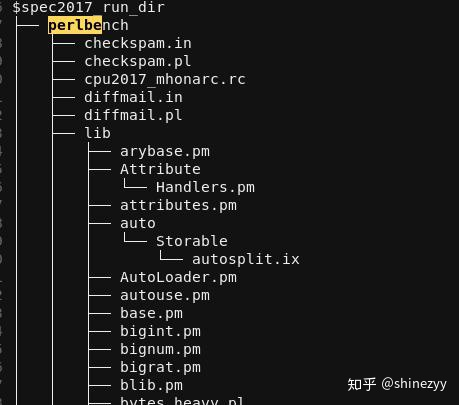
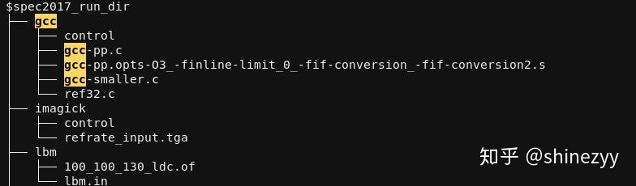

# 标题党：开箱即用的GEM5教程

在我们实验室内部，我基本上做到了开箱即用，因为我可以直接把各种现成的文件拷贝给师弟。但因为SPEC的知识产权问题，导致我不能直接拷贝SPEC06/17的二进制和输入文件，所以我只能打包工具链出来。因此这是一篇标题党文章。

首先说明一点：这些脏活其实和体系结构研究本身关系不算很大，难度也不算大，但是比较费时间，部分电子、微电子出身的同学可能吃不消这一套。他们本身只是用来做一下简单的任务，如果花太多时间学习工具很不划算。所以我做了这个教程，希望可以帮这些入门的同学节约时间。

照着这篇文章做了，你可以达到的目的是：在GEM5上运行RISC-V (RV64G)的SPEC2017/2006。我们以SPEC 2017为例。假设你现在手上已有的资源是：SPEC 2017的源码，并且已经安装好了；GEM5的源码（建议用[这个repo](https://github.com/shinezyy/gem5)，我增加了很多脚本），并且已经编译好了；下载现成的某个版本的[RISC-V toolchain](https://drive.google.com/file/d/1s93eUZk7mcNnWsixkCiC1i0CUQiX6nYH/view)并解压 （完全可以自己编译一遍RV-gnu-toolchain，这里是方便新手）

## 编译SPEC 2017

假设你设置了环境变量`spec17root`指向SPEC 2017的安装目录；假设`/path/to/toolchain`是解压出来的工具链 的目录。

1. 这里是一个[示例config文件](https://drive.google.com/file/d/1eFj1eM0KYGukoz0P5PXsLwKl_9n6yGNw/view)，把它下载到`$spec17root/config`目录下。然后把`rv64g.cfg`文件中的`define gcc_dir` 后面的部分改为`/path/to/toolchain`。
2. `cd $spec17root` 
3. `source shrc` 
4. `runcpu -config=rv64g -action build all tune=base` 

如果没有什么报错，那应该就完事儿了。如果有报错，可以留言。

## 拷贝SPEC 2017的输入文件

如果创建进程的脚本写得更好，按理说是不需要这一步的，但是我……一言难尽，有兴趣可以看看这个 [创建进程的脚本](https://github.com/shinezyy/gem5/blob/master/configs/spec2017/get_spec_proc.py) 和 [这个目录](https://github.com/shinezyy/gem5/tree/master/configs/spec2017)。我直接用了SPEC 2017 dry run的输出作为模板，简单parse一下来创建进程。dry run命令没有指明文件路径，所以你需要干这个脏活。

1. 创建一个目录，用于存放输入文件，环境变量`$spec2017_run_dir` 指向该目录。
2. 把`$spec17root/benchspec/CPU/502.gcc_r/data/refrate/input` 、`$spec17root/benchspec/CPU/500.perlbench_r/data/all/input`等目录下面的文件对应拷贝到`$spec2017_run_dir/gcc`和 `$spec2017_run_dir/perlbench`目录[[1\]](https://www.zhihu.com/people/shinez-zhou/posts#ref_1) 。行为很简单，一个10行代码的程序就可以做到。最后的组织形式如图：

## 修改配置文件

这一步是告诉GEM5可执行文件的位置、名字，输入数据的位置，输出统计数据的位置。

- 可执行文件的位置：增加环境变量`cpu_2017_dir=$spec17root/benchspec/CPU`，[util/run_sh_scrpits/common.py](https://github.com/shinezyy/gem5/blob/master/util/run_sh_scrpits/common.py) 会获取该变量。
- 可执行文件的后缀：因为一般编译好一份binary就会用很久，所以这个直接写死在[configs/spec2017/se_spec17.py](https://github.com/shinezyy/gem5/blob/master/configs/spec2017/se_spec17.py)的`arch_suffix`字典里面，把`'RISCV': '_r_base.rv64g-gcc-8.2-64'`的后半部分改为你编译的binary的后缀即可。
-  输入数据的位置：前面已经定义好了环境变量`$spec2017_run_dir`， [util/run_sh_scrpits/common.py](https://github.com/shinezyy/gem5/blob/master/util/run_sh_scrpits/common.py) 也会获取该变量
- 输出统计数据的位置：[util/run_sh_scrpits/common.py](https://github.com/shinezyy/gem5/blob/master/util/run_sh_scrpits/common.py)的`stats_base_dir`目录，按需设置。 

目前的[util/run_sh_scrpits/spec17-run.py](https://github.com/shinezyy/gem5/blob/master/util/run_sh_scrpits/spec17-run.py)文件适用于已经创建好了simpoint checkpoints，如果你还没有checkpoints，那么需要修改相关的行：

在`options`中删除

- `'--restore-simpoint-checkpoint',`

- `'-r 2',` 

- `'--checkpoint-dir={}'.format(pjoin(c.gem5_cpt_dir(arch, 2017), benchmark)),` 

修改`prerequisite = os.path.isfile(cpt_flag_file)` 为`prerequisite = True` 

## 运行

切到gem5的[util/run_sh_scrpits](https://github.com/shinezyy/gem5/tree/master/util/run_sh_scrpits)目录，运行`python3 `[spec17-run.py](https://spec17-run.py/) 

输出结果应该就在`stats_base_dir` 目录下面

## 参考

1. 根据自己的需求选择rate和speed。rate和speed的区别：Q15. What are "SPECspeed" and "SPECrate" metrics? https://www.spec.org/cpu2017/Docs/overview.html

