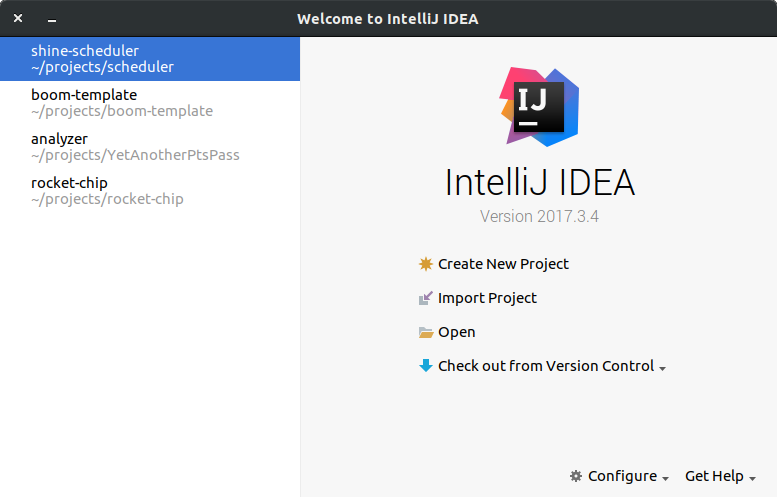
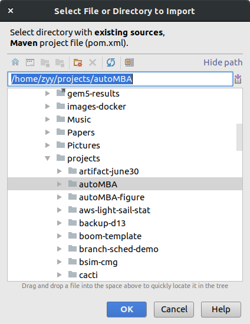
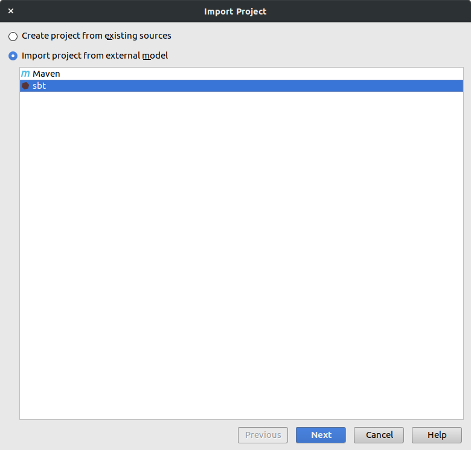
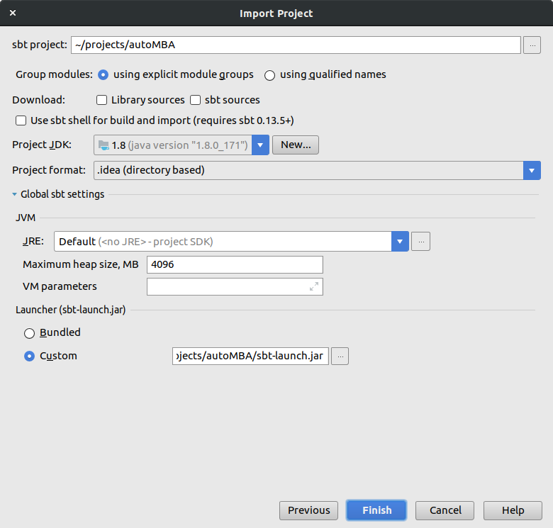
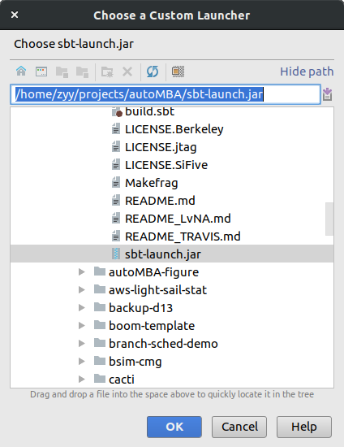

### 前置条件

确保已经用rocket自带的sbt-launch.jar编译过rocket chip，比如已经可以上FPGA或者已经编译出emulator了。

### 导入的图文过程

假如已经用idea打开过rocket chip，但是没有成功导入依赖导致全线飘红，可以考虑删除.idea目录重新导入。

首先启动intellij，"Import Project"

然后选择rocket chip的项目目录

然后intellij发现这是一个sbt项目，提示可以通过sbt导入。所以我们选择从sbt导入，"Next"

接下来是导入的设置界面，这是我的设置：

注意Launcher那里选择Custom，使之指向rocket chip自带的sbt：

最后在设置页面点Finish即可，过几分钟就可以解析完了。
