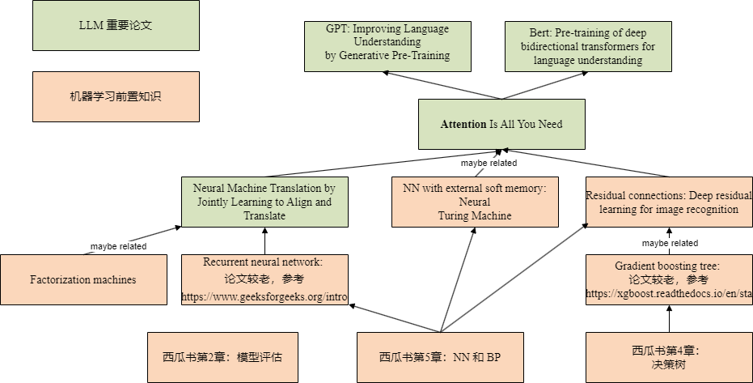
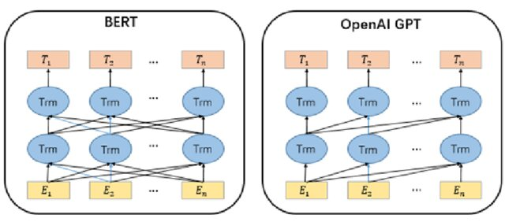
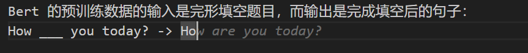

# 非 AI 背景的人如何入门大模型（一）

*关于笔者：我是计算机系统结构博士，目前在带领一个小团队做高性能 RISC-V 处理器的架构预研，
主要工作内容是 workload characterization、性能模拟和架构设计。*

# 前言

现在我工作的地方，同事、同学主要是计算机系统结构或微电子背景。
很多人对 AI 有兴趣，但多是坐观垂钓者，徒有羡鱼情。
从本科到研究生，我身边的机器学习氛围一直很浓，使得我这几年多少了解一些 AI 的进展，
因此我作为外行，斗胆来写这样一篇文章。
如果理解有偏差或者疏漏，欢迎各位指正。

本系列文章主要介绍要理解现在大语言模型（LLM）用到的算法、算法的负载特征和算法的加速所需要的前置知识。
本系列文章**不会详细介绍算法本身**，而是引导读者阅读相关的教材、论文和网络讨论。
本文假设读者是计算机或者相关背景，学习过线性代数和概率论。

本文只介绍理解 Transformer 相关的前置知识，因此省略了很多机器学习的重要进展。
例如卷积神经网络（CNN）和强化学习（RL）都在二十一世纪 10 年代留下了浓墨重彩的一笔，但是本文不会介绍。
不过，仍然鼓励读者了解相关知识和历史：机器如何在视觉任务、围棋上战胜人类。

本文推荐的阅读材料及其关系如下图所示，可以打开 [draw.io 源文件](https://tinyurl.com/24opnno9) 查看。
打开的网页上方有一个 `Open with draw.io`，在 draw.io 可以通过 `make a copy` 保存到自己的 Google Drive 中。
如果没有这个按钮，也可以下载 draw.io 源文件，然后手动上传到 draw.io 打开。
然后就可以编辑和直接复制论文标题，到 Google Scholar/Arxiv 搜索论文了。

# 机器学习基础

首先是机器学习的基础知识，建议学习《西瓜书》第二章模型评估、第四章决策树和第五章神经网络。
因为我以前上周志华的课，所以用《西瓜书》举例。
可以根据个人偏好替换为李航的《统计机器学习》或者 Jordan 的《Pattern Recognition and Machine Learning》中的对应部分。
学习模型评估，是为了让初学者理解训练、泛化等基本概念。
学习决策树，是为了方便理解 gradient boosting tree。
学习神经网络，因为它是大模型的基础。

如果要加深这部分的认知，理论部分建议推一推链式求导（我曾经会，现在也忘得差不多了）；
实践部分，可以考虑用 C++ 实现一下简单的神经网络和 gradient boosting tree。

然后，我建议学习 gradient boosting tree 和何恺明的 residual connection。
Residual connection 是训练深层神经网络时解决梯度消失等问题的关键技术之一。
就我自己写 gradient boosting 的代码的感受来看，gradient boosting 和 residual connection 两者的思想有相通之处：
Gradient boosting 的 第 `n+1` 个模型拟合输出与前 `n` 个模型拟合输出的伪残差（实际上是 MSE 的梯度），
而 residual connection 的残差来自于上一层（或几层）之前的输出与本层计算的输出之差。

关于 gradient boosting 和 residual connection。除了原本的论文之外，可以参考这些社区讨论：
1) [XGBoost 的文档对 tree、gradient boosting 的科普](https://xgboost.readthedocs.io/en/stable/tutorials/model.html)
2) [Resnet到底在解决一个什么问题呢？ - 薰风初入弦的回答 - 知乎](https://www.zhihu.com/question/64494691/answer/786270699)
3) [Are Residual Networks related to Gradient Boosting?](https://stats.stackexchange.com/a/349987)
4) [Why do we use gradients instead of residuals in Gradient Boosting?](https://datascience.stackexchange.com/questions/31609/why-do-we-use-gradients-instead-of-residuals-in-gradient-boosting)

# Attention is All You Need

Attention is All You Need 或许是这个领域最重要的论文，不过它用到的思想并非凭空诞生。
Nerual Machine Translation by Jointly Learning to Align and Translate （本文简称为NMT）
应该是首次提出 Attention 概念的论文，其结构已经和 Transformer 非常相似：
面对自然语言的序列预测问题，NMT 以 Recurrent Neural Network（RNN）为基础，
用第 N 个 Token 与前面 N-1 个 Token 显式地进行特征交互（feature interaction）。
可以说 Transformer 的 `Q` 和 `K` 在 NMT 中已经初具雏形。

关于特征交互，NMT 也不是首次提出特征交互的论文。
早在 2010 年，Factorization Machines 就用到了显式的特征交互（我不知道是不是第一个）。

Transformer 和 NMT 中的网络结构的关键不同在于
Transformer 有一个显式的 `V`，它与 `K`是分离的。
有人认为（包括我），Attention 结构里的 `V` 可以理解为一种只读的存储器，
对它的 “寻址” 是通过 `Q` 和 `K` 的相乘之后的 Softmax 来实现。
Attention 之前有一个工作叫做 Neural Turing Machine，
它会显式地存储和读取数据到一个 “soft addressable” 的存储器中。
Neural Turing Machine 让神经网络拥有读写存储器的能力，可以用来学习一些计算机算法。
当然，Neural Turing Machine 的结构和 Transformer 有很大不同，
这仅仅是我看待 `V` 的一种视角。

为了训练深度网络，Transformer 还用到了 Residual Connection，
前文已经推荐过了。

# LLM

*[图片来源链接](https://www.researchgate.net/publication/354908597_BERT_Pre-training_Acceleration_Algorithm_Based_on_MASK_Mechanism)*

基于 Transformer，大模型的时代到来了，其中最有名的两个基础模型是：Bert （双向模型）和 GPT（前向模型）。
我看过一个非常直观的比喻说 Bert 类似于高中英语的完形填空，而 GPT 类似于作文。
GPT 的预训练数据的输入是对话的前半段、作文的题目描述，
输出是对话的后半段、作文的内容。
Bert 的预训练数据的输入是完形填空题目，而输出是完成填空后的句子：
`How ___ you today? -> How are you today?`

在 ChatGPT 取得巨大的成功之后，大家逐渐承认 GPT 这样的前向模型的上限更高，
毕竟写作文是比完形填空更难的任务。
例如 Github CoPilot (backbone model 是 GPT-3 衍生出的 CodeX)，
它也能做好完形填空任务：

本文要推荐的主要论文和资料就到此结束了。

# 讨论 & 本文遗漏的部分

关于文章的正确性和严肃性，考虑到我是**斗胆**来写这样一篇文章的外行，
如果文档理解有偏差或者疏漏，欢迎各位指正。

关于后面写什么。笔者是计算机系统结构背景，所以主要兴趣还是在大模型加速。
但是陈天奇他们的[关于推理加速的综述](https://arxiv.org/pdf/2312.15234)写得非常全面了，
我是否还有必要写呢？如果在某些方面我能写得更易懂，或者提供一点点 insight，那么我会写一写。

关于 Transfromer 的网络结构，本文还遗漏了一些重要知识，后续有机会补上，读者也可以自行学习：
1) Word2Vec；
2) Softmax；
3) Positional Encoding。

从 2010 至今机器学习算法的重要进展，本文没有覆盖，读者可以自行学习：
1) 卷积神经网络；
2) 强化学习；
3) 生成对抗网络。

*本文同步发表于 [ShineZ的博客](https://shinezyy.github.io/ArchShineZ/post/llm-for-non-ai-guys/)，因为是用 Markdown 转换为 Word 之后发布到知乎，知乎文章的排版可能略有瑕疵。*