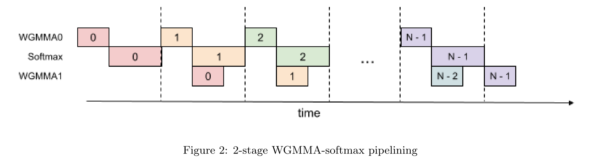
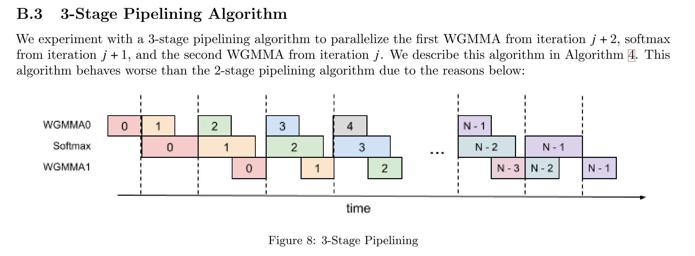

# 简介
与上一篇文章不同，本文主要目的是介绍模型的建模方法，以及搜索吞吐最大配置的方法。
TL;DR: H800、H20、A100、L20 的数据附在文末（不构成买卡建议）。

# 吞吐计算方法

本文采用的估算方法：
首先假设平均上下文长度为 5K （5K 上下文是参考 shen han 的文章：https://zhuanlan.zhihu.com/p/29841050824），
然后用 DRAM 容量作为约束，计算出最大的 batch size per card。
然后对单个 token 的延迟进行估算，得到 token per second。
最后计算单卡的吞吐 = batch size per card * token per second。

# 算法建模
为了简化，我只建模 Decoding 阶段，并且只计算稀疏层 （FFN 的 experts 多数为 routed expert 的层，一共 58 层） 的时间。
因为稠密层（FFN 全部为 shared expert 的层，一共 3 层） 占比很小，当前版本的模型直接用 sparse layer 的时间乘 61 层。

根据前期计算结果，下面几个算子/流水级在推理过程中时间占比最大。因此本模型对它们增加了可选的手动矫正，具体矫正方法在本小节后面介绍。

- FlashMLA
- 稀疏层 Dispatch 和 Combine 的时间
- GEMM

对矩阵运算，根据矩阵形状进行 MFU 修正后再用 Roofline 进行运行时间估算：

``` Python

    # Compute time if memory-bound (data transfer limited)
    memory_time = total_bytes / mem_bw

    # Compute time if compute-bound (FLOP limited)
    compute_time = total_flops / flops

    return max(memory_time, compute_time)
```

> Roofline 模型是一种用于分析计算程序性能上限的直观工具，通过结合硬件算力与内存带宽限制，揭示程序在不同计算密度下的性能瓶颈。

> MFU：Model FLOPS Utilization = 模型推理过程所达到的 FLOPS / 硬件理论 FLOPS

## FlashMLA MFU 矫正

我最初的矫正方法是乘上一个系数，使得最终的 flops 匹配 FlashMLA 公开的数据，后来感觉这么搞不是很靠谱。
现在的方法分为两部分，第一部分考虑 GEMM 和 Softmax 无法完全重叠的问题；
第二部分考虑矩阵形状（偏小）对 MFU 的影响。

### 建模GEMM 和 Softmax 无法完全重叠的问题

[Flash attention V3 (FA3) 的论文](https://arxiv.org/abs/2407.08608)
说因为编译器重排、寄存器压力等原因，Attention 的 2 个 GEMM 和 1 个 Softmax 无法完全 overlap，
只有其中一个 GEMM 和 Softmax 能够完美掩盖：
<!-- insert picture -->


而理想情况下，下一代的推理芯片如果能完美掩盖，应该可以满足这样的流水化结果：


为此，我在建模硬件时，增加了 2 个参数：
``` Python

        self.two_stage_fa3 = False
        self.three_stage_fa3 = False
```
对于未来的理想的推理芯片，我设置 `three_stage_fa3 = True`；
对于 H800/H20，我设置 `two_stage_fa3 = True`；
对于 L20/A100 等 Ada、Ampere 世代的卡，两个选项都是 `False`，因为直到 Hopper 才引入 wgmma.async，才能实现 FA3。

计算 MLA 时间的方法如下（与前面的两张图相对应）：
``` Python

        if hw.three_stage_fa3:
            compute_time = max(vector_time, all_gemms_time)
            not_overlapped_tensor_time = max(0, all_gemms_time - vector_time)
        elif hw.two_stage_fa3:
            compute_time = gemm_times[0] + max(vector_time, gemm_times[1])
            not_overlapped_tensor_time = gemm_times[0] + max(0, gemm_times[1] - vector_time)
        else:
            compute_time = all_gemms_time + vector_time
            not_overlapped_tensor_time = all_gemms_time
```

>我不知道现在 CUDA 编译器有没有改进？H 卡/B 卡能不能实现 3-stage 的完美覆盖？
希望有相关信息的朋友在评论区或者 PM 戳我一下，我来观摩学习。

### FlashMLA 手动 MFU 矫正

Flash Attention 只能在 SRAM 中计算，矩阵的典型尺寸是 M=128/256，K=576，N=512-4K， 两个 GEMM 都是不容易跑满的形状。
此版本的模型根据网上现有的数据进行粗暴的矫正：
H20 由于其奇特的计算访存比，单独用 125/148 的矫技稀疏；
剩下的卡的计算访存比都（相对）与 H100 更为接近，因此暂时用 H100 的数据。

``` Python
if hw.name.startswith("H20"):
    # https://github.com/deepseek-ai/FlashMLA/issues/30
    if self.q_len * self.head_count == 256 or self.q_len * self.head_count == 128:
        self.discount_factor = 125/148
    else:
        raise ValueError(f"Unsupported q_len * head_count: {self.q_len * self.head_count}")
else:
    # other GPUs have larger compute density, currently using H100 as reference
    # Using results from https://github.com/ai-bot-pro/achatbot/pull/123
    if self.q_len * self.head_count == 256:
        self.discount_factor = 550/989
    elif self.q_len * self.head_count == 128:
        self.discount_factor = 510/989
    else:
        raise ValueError(f"Unsupported q_len * head_count: {self.q_len * self.head_count}")
```


## GEMM MFU 矫正 

MoE 矩阵的 MFU 可以参考 [DeepGEMM](https://github.com/deepseek-ai/DeepGEMM) 给出的数据。
具体地，在生成 MoE 的 GEMM 时，给每个 GEMM 标注 discount factor：
``` Python

def moe_factory(self, bs, dense=False):
    up_dim = self.dense_internal_dim if dense else self.moe_internal_dim
    # There are 2 up_project matrix here, so we can concat them at the N dimension
    moe_up_x2 = MMOp(bs, self.hid_dim, up_dim*2, elem_size=1, acc_size=4, name="moe_up_x2")
    moe_down = MMOp(bs, up_dim, self.ffn_output_dim, elem_size=1, acc_size=4, name="moe_down")

    if not self.use_deep_gemm_for_moe:
        return moe_up_x2, moe_down

    # else: apply deep gemm discount factor
    # using data from https://github.com/deepseek-ai/DeepGEMM
    if bs >= 1024:
        moe_up_x2.deep_gemm_disc_factor=1233/1979
        moe_down.deep_gemm_disc_factor=925/1979
    elif bs >= 512:
        moe_up_x2.deep_gemm_disc_factor=1040/1979
        moe_down.deep_gemm_disc_factor=916/1979
    elif bs >= 256:
        moe_up_x2.deep_gemm_disc_factor=932/1979
        moe_down.deep_gemm_disc_factor=815/1979
    elif bs >= 128:
        moe_up_x2.deep_gemm_disc_factor=533/1979
        moe_down.deep_gemm_disc_factor=510/1979
    else:  # using factor of 64
        moe_up_x2.deep_gemm_disc_factor=287/1979
        moe_down.deep_gemm_disc_factor=295/1979

    return moe_up_x2, moe_down
```

在计算 GEMM 延迟时，把 `deep_gemm_disc_factor` 带入：

``` Python

    used_flops = hw.fp8_FLOPS if op.elem_size == 1 else hw.bf16_FLOPS

    discount_note = ""
    if op.elem_size == 1 and op.deep_gemm_disc_factor != 1:
        used_flops *= op.deep_gemm_disc_factor
        discount_note = f" with DeepGEMM discount factor {op.deep_gemm_disc_factor:.2f}"
```

对于不使用 DeepGEMM 的操作，按照 [NV 官方的 A100 的 MFU](https://docs.nvidia.com/deeplearning/performance/dl-performance-matrix-multiplication/index.html) 进行矫正。
我先挑选 M N K 中最小的一维，然后对官方的 MFU 曲线进行线性近似。
在此基础上，我打了一个补丁：在上面这个文档里，当矩阵的 M/N 较小的时候 MFU 不到 10%，但是 DeepGEMM 里形状相似的矩阵实际上可以达到更高的 MFU。
因此，我乐观地认为，当 K > 4096 且 M/N 中至少有一个大于 1536 时，经过恰当的优化可以达到 15% 的 MFU。

``` Python

discount_factor = 0
if op.K < min(op.M, op.N):
    # determine the discount factor by K
    log_2_k = np.log2(op.K)
    slope = (200-50)/(9-6)  # from https://docs.nvidia.com/deeplearning/performance/dl-performance-matrix-multiplication/index.html
    if log_2_k >= 10:
        discount_factor = 260/312
    elif 6 <= log_2_k and log_2_k < 10:
        discount_factor = (50 + slope * (log_2_k - 6))/312
    else:
        # No operation in Deepseek has K < 64?
        assert op.K >= 64
        discount_factor = 50/312

    used_flops *= discount_factor
    discount_note = f" with K discount factor {discount_factor:.2f}"
else:
    # determine the discount factor by min(M, N)
    mn_min = min(op.M, op.N)
    log_2_min = np.log2(mn_min)
    slope = (230-30)/(11-8)  # from https://docs.nvidia.com/deeplearning/performance/dl-performance-matrix-multiplication/index.html
    if log_2_min >= 11:
        discount_factor = 260/312  # 312 is the peak flops of A100
    elif 8 <= log_2_min and log_2_min < 11:
        discount_factor = (30 + slope * (log_2_min - 8))/312  # 312 is the peak flops of A100
    else:
        discount_factor = 30/312

    if op.K > 4096 and (op.M >= 1536 or op.N >= 1536) and mn_min >= 64:
        # Data from NV might be too conservative.
        # As soon as one of M/N > 1536, it is possible to achieve ~15% MFU, according to https://github.com/deepseek-ai/DeepGEMM
        # So we assume disc factor is at least 289/1979
        discount_factor = max(discount_factor, 289/1979)
    
    used_flops *= discount_factor
    discount_note = f" with MN discount factor {discount_factor:.2f}"
```

# 网络建模

我根据 DeepEP 中的数据手动给网卡的有效带宽进行了赋值。其中 E810 不一定指具体的型号，只是为了代表一类较为便宜的 RoCE v2 网卡。
如果要建模 speculative decoding/MTP，记得在计算 dispatch 和 combine 的时间时把 q_seq_len 算上：`effective batch size = batch size * q_seq_len`。

``` Python

class NIC:
    def __init__(self, name, bw):
        self.name = name
        self.bw = bw

class CX7(NIC):
    def __init__(self):
        super().__init__("CX7 400Gbps", 40 * 1024**3)

class E810(NIC):
    def __init__(self):
        super().__init__("E810 100Gbps", 10 * 1024**3)
```

RDMA 通信时间计算：
``` Python

def compute_combine_latency(self, nic_bw, bs):
    combine_elem_size = self.non_moe_elem_size
    experts_to_combine = bs*self.sparse_expert_per_token
    combine_packet_size = self.hid_dim * combine_elem_size * experts_to_combine
    comibine_lat = compute_rdma_latency(nic_bw, combine_packet_size)

def compute_rdma_latency(card_effective_bw, tx_bw):  # both in Bytes/s
    latency = tx_bw / card_effective_bw
    return latency
```

# GPU 建模

对建模 GPU 时用到的部分参数的解释：

- `fp8_FLOPS` 在 A100 这样的设备上用 int8 算力替代
- `exp2_FLOPS` 和 `reduce_FLOPS` 由 SM 里的功能单元数量决定，在 [CUDA 编程手册](https://docs.nvidia.com/cuda/cuda-c-programming-guide/) 里有具体的数值。这两个单元影响了 Softmax 的吞吐
- `thread_all_reduce_latency` 用于模拟不用的 AI core/SM 在 SoC 级别做 reduce 的时间，我不确定用来建模 GPGPU 是否合适，主要是用于指导我自己的芯片规格制定。但是这部分的建模还略微粗糙，我还需要再多审视一下
- `sram_sz` 影响了 Flash Attention 每次能切多长的 sequence，这对矩阵的形状、softmax rescale 的次数有影响，但是这部分我建模的方式还比较粗糙

``` Python

class Hardware:
    def __init__(self, name):
        self.name = name
        self.mem_bw = 0
        self.bf16_FLOPS = 0
        self.fp8_FLOPS = 0
        self.exp2_FLOPS = 0
        self.reduce_FLOPS = 0
        self.thread_all_reduce_latency = 0.5 * 1e-6  # 0.5 us
        self.mem_sz = 0
        self.fp8_low_acc_precision = False
        self.sram_sz = 0
        self.two_stage_fa3 = False
        self.three_stage_fa3 = False
```
#	并行方式建模

我的模型不建模 Tensor Parallelism (TP)，只建模简单的 Data Parallelism 和 Expert Parallelism，因为我设计的芯片没有 NVLink。
经过向 Zartbot 和 shen han 的学习，我意识到 **H20的最优解大概率是需要开启 TP 的，所以本文 H20 的吞吐仅供参考**。

> 具体来说，本文为了保证 QoS 达标的做法是降低 batch size，但是降低 batch size 会降低矩阵形状从而降低 MFU。
对于像 H20 这样受限于算力的卡，降低 batch size 能等比例地降低 core attention 的时间，但是很多左矩阵为“横条”的操作的时间无法被显著降低。
因此，实践中，为了不损失 MFU，大家会选择用 TP 来满足时延需求，大概率可以获得比降 bs 更好的效果。
举个例子：在 1 张卡上做 128x4096x4096 的操作受限于计算。如果降低一半的 bs，那么 1 张卡上的操作就变成 64x4096x4096，此时矩阵形状变差，
MFU 下降，在最极端的情况下甚至可能损失 50% 的MFU，导致没有性能提升。
但是如果开启 TP=2，会在两张卡上做 128x4096x2048 的操作，此时矩阵形状还不错，仅仅损失了一些通信时间，对有 NVLink 的机器较为友好。


EP 数量用于计算每张卡的 expert 数量：
``` Python

    def sparse_expert_per_card(self):
        return np.ceil(self.expert_count / self.ep_count)
```
`sparse expert` 就是大家常说的 `routed expert`

目前我建模了两种流水线：

- naive 流水线，不做任何 overlapping
- dual micro batch，就是官方公布的 EP144 所使用的 overlapping 方案

Naive 流水线计算时间是每一层的时间相加，而 dual micro batch 则是按照官方的方法来划分流水级。
目前 dual micro batch 的流水级划分在任何配置下都和官方公布的 EP144 的方式一致，没有做更多的设计空间探索。

> 理论上，可以根据时间的算子时间进一步调整流水级切分获得更好的性能


计算 token 时延时，用一个关键路径时间乘上 micro batch 的次数：

``` Python

    def final_report(self, overall_lat, bs, micro_batch_count=1):
        overall_lat = overall_lat * micro_batch_count
        user_token_per_sec = 1 / (overall_lat * self.n_layers)
```

# 可选的参数配置

``` Python
hist_len = 5 * Ki 
cards = [H800(), H20(), A100(), L20()]
nics = [CX7(), E810()]
for dev in cards:
    for nic in nics:
        for speculative_decode_len in [0, 1]:
            for kvc_sz, non_moe_param_sz, deep_gemm in [(2, 2, True), (1, 2, True), (1, 1, True)]:
                for policy in ['dual-mbatch', 'naive']:
```
参数解释：

- `cards` 和 `nic` 就是 GPU 和网卡，不展开介绍。
- `kvc_sz` 是 KV cache 的元素大小，如果用 fp8 就是 1，如果用 bf16 就是 2。
`non_moe_param_sz` 是除了 Expert 之外的参数的元素大小，如果用 fp8 就是 1，如果用 bf16 就是 2。

    - 当这两个参数都为 2 时，就是 Deepseek 官方的配置。
    - 当 `kvc_sz=1, non_moe_param_sz=2` 时，KV cache 的容量需求和访存带宽需求减半，但是 flashMLA 仍然用 bf16 计算，用 GPU 的 bf16 flops 来估算时间。
    - 当 `kvc_sz=1, non_moe_param_sz=1` 时，flashMLA 改为用 fp8 计算。
- `deep_gemm` 如果设为 `True`，MoE 计算时会用 DeepGEMM 提供的数据对 MoE 层的 GPU 的 fp8 flops 进行矫正，否则就用 NV 提供的 A100 的 MFU 数据进行矫正。

## 推测解码
`speculative_decode_len` 是指利用 Deepseek 自带 eagle-like layer 进行推测解码的长度。

> 对计算机体系结构背景的同学，可以用分支预测器类比来理解LLM的推测解码（Speculative Decoding）：
推测解码相当于在语言模型推理时引入"分支预测+乱序执行"机制：用小模型（快速但低精度）预测未来token（类似分支预测器），用大模型（慢速但高精度）并行验证（类似ALU执行），通过验证命中率换取整体加速。区别在于，推测错误在 CPU 中会回滚流水线，而在 LLM 中则会占用额外的计算资源。

> eagle layer 是一种特殊的 Transformer 层，用大模型最后一层的 feature （属于第 N-1 个 token） 和预测出来的第 N 个 token
作为输入，再进行一次自回归解码。这种范式是目前准确率最高的推测解码方法。
eagle-like layer 是 Deepseek V3 里用到的结构，和 eagle layer 略有不同。

在端侧，`speculative_decode_len` 可以配置得很长，从而提升单用户的延迟。
在云侧，`speculative_decode_len` 一般设置为 0-1，因为云侧追求吞吐，而推测错误损失吞吐。

我在建模时设置 `q_seq_len = 1 + speculative_decode_len`，
增大该参数会增加 MoE 层的 batch size，增大 Attention Projection 的 batch size，增大计算 `qK^T` 时 q 矩阵的 M 维，
从而使得任务更加计算密集。
在一定范围内，M 更大，矩阵计算的 MFU 更高。因此对很多操作而言，开启推测解码可以提升计算强度，“白嫖”一些吞吐。
在网络通信方面则无法白嫖，因为无论你的推测解码的预测是否正确，都会增加网络通信的负担，向 Routed Expert 发送的报文数量也会随之增加。


`speculative_decode_len` 也会影响最终的 ux_tps（user-experienced token per second）和有效吞吐：
``` Python
overall_lat = overall_lat * micro_batch_count
raw_token_per_sec = 1 / (overall_lat * self.n_layers)
print(f"Per layer time per user: {overall_lat*10**6:.2f} us")
print(f"Per forward pass time per user: {overall_lat*10**3 * self.n_layers:.2f} ms")
print(f"Raw token per second: {raw_token_per_sec:.2f}")
# self.q_seq_len - 1 == speculative decode length
speculation_success_token_count = 0
for i in range(1, self.q_seq_len):
    speculation_success_token_count += pow(0.85, i)
ux_tps = raw_token_per_sec * (1 + speculation_success_token_count)
print(f"User experienced token per second: {ux_tps:.2f}, speculation success token count: {speculation_success_token_count:.2f}")

throughput = raw_token_per_sec * bs * (1 + speculation_success_token_count)
```
其中 `0.85` 是 Deepseek V3 TR 里面给出的值，和目前 SOTA 的推测解码方法报告的数值相符（Eagle2、HASS 和 EAGLE-3）。

# 配置搜索

搜索的目标是最大化吞吐，约束是 Batch size 不能太大导致 DRAM 装不下 KV cache，如果爆了就降低 batch size。
第二个约束是 QoS 约束（ux_tps：user-experienced token per second），如果 `ux_tps < target_ux_tps` 就降低 batch size。

``` Python

ux_tps = 0
bs = 128 + 8

while ux_tps < target_ux_tps and bs > 8:
    bs -= 8
    if policy == 'dual-mbatch':
        ds = DeepSeekV3(hist_len, 1 + speculative_decode_len, bs, kvc_elem_size=kvc_sz, non_moe_param_elem_size=non_moe_param_sz)
        ds.promo_discount = promotion
        ds.ep_count = ep
        if bs > ds.compute_max_bs_per_card_by_mem_size(dev):
            continue
        ux_tps, throughput = ds.model_dual_micro_batch_decode(bs, dev, nic.bw)
    else:
        assert policy == 'naive'
        ds = DeepSeekV3NaiveDecode(hist_len, 1 + speculative_decode_len, bs,  kvc_elem_size=kvc_sz, non_moe_param_elem_size=non_moe_param_sz)
        ds.promo_discount = promotion
        ds.ep_count = ep
        if bs > ds.compute_max_bs_per_card_by_mem_size(dev):
            continue
        ux_tps, throughput = ds.model_naive_decode(bs, dev, nic.bw)

if ux_tps >= target_ux_tps and bs > 8:
    perf_results.append([dev.name, nic.name, policy, ep, kvc_sz, non_moe_param_sz, bs, promotion, ux_tps, throughput, speculative_decode_len])

```

# 方案搜索结果

去重：
``` Python

   df = df.sort_values(by=['Throughput Per card'], ascending=False).drop_duplicates(subset=['GPU', 'NIC', 'EP', 'Non-expert param elem size'], keep='first')
```

TPS > 20 的方案：

| GPU  | NIC          | Pipe policy | EP  | KVC elem size | Non-expert param elem size | BS  | DeepGemm | UX TPS     | Throughput Per card | MTP Len |
|------|--------------|-------------|-----|---------------|----------------------------|-----|----------|------------|---------------------|---------|
| H800 | CX7 400Gbps  | dual-mbatch | 320 | 1             | 1                          | 128 | TRUE     | 28.9283602 | 3702.83011          | 1       |
| H800 | CX7 400Gbps  | dual-mbatch | 144 | 1             | 1                          | 128 | TRUE     | 25.3533733 | 3245.23178          | 1       |
| H800 | CX7 400Gbps  | dual-mbatch | 320 | 1             | 2                          | 128 | TRUE     | 20.5797242 | 2634.2047           | 0       |
| H800 | CX7 400Gbps  | dual-mbatch | 72  | 1             | 1                          | 128 | TRUE     | 20.3288631 | 2602.09448          | 1       |
| H800 | CX7 400Gbps  | dual-mbatch | 144 | 1             | 2                          | 80  | TRUE     | 28.3847954 | 2270.78363          | 1       |
| H800 | CX7 400Gbps  | dual-mbatch | 72  | 2             | 2                          | 88  | TRUE     | 21.631899  | 1903.60711          | 1       |
| H800 | E810 100Gbps | dual-mbatch | 320 | 1             | 1                          | 64  | TRUE     | 22.4657618 | 1437.80876          | 0       |
| A100 | CX7 400Gbps  | dual-mbatch | 320 | 1             | 1                          | 64  | TRUE     | 21.8744074 | 1399.96207          | 1       |
| H800 | E810 100Gbps | dual-mbatch | 144 | 1             | 1                          | 64  | TRUE     | 21.130419  | 1352.34682          | 0       |
| A100 | CX7 400Gbps  | naive       | 144 | 1             | 1                          | 56  | TRUE     | 21.0442842 | 1178.47991          | 1       |
| H800 | E810 100Gbps | dual-mbatch | 72  | 1             | 1                          | 32  | TRUE     | 34.9379234 | 1118.01355          | 1       |
| A100 | CX7 400Gbps  | naive       | 72  | 1             | 1                          | 32  | TRUE     | 31.2735432 | 1000.75338          | 1       |
| H800 | E810 100Gbps | dual-mbatch | 320 | 1             | 2                          | 40  | TRUE     | 23.7693815 | 950.775262          | 0       |
| H20  | CX7 400Gbps  | naive       | 320 | 1             | 1                          | 40  | TRUE     | 22.2571103 | 890.284412          | 1       |
| H800 | E810 100Gbps | dual-mbatch | 144 | 2             | 2                          | 40  | TRUE     | 22.1981281 | 887.925125          | 0       |
| A100 | E810 100Gbps | dual-mbatch | 320 | 1             | 1                          | 40  | TRUE     | 20.423625  | 816.945001          | 1       |
| H800 | E810 100Gbps | dual-mbatch | 72  | 2             | 2                          | 32  | TRUE     | 25.0675241 | 802.16077           | 1       |
| H20  | CX7 400Gbps  | naive       | 144 | 1             | 1                          | 32  | TRUE     | 23.9194245 | 765.421585          | 1       |
| A100 | CX7 400Gbps  | naive       | 320 | 1             | 2                          | 32  | TRUE     | 23.7288273 | 759.322475          | 1       |
| A100 | E810 100Gbps | naive       | 144 | 1             | 1                          | 32  | TRUE     | 22.6969865 | 726.303569          | 1       |
| A100 | CX7 400Gbps  | naive       | 144 | 2             | 2                          | 32  | TRUE     | 22.4446861 | 718.229954          | 1       |
| A100 | E810 100Gbps | naive       | 72  | 1             | 1                          | 32  | TRUE     | 20.4578472 | 654.65111           | 1       |
| A100 | CX7 400Gbps  | naive       | 72  | 2             | 2                          | 32  | TRUE     | 20.2526468 | 648.084699          | 1       |
| H20  | E810 100Gbps | naive       | 320 | 1             | 1                          | 16  | TRUE     | 24.8169232 | 397.070771          | 1       |
| H20  | E810 100Gbps | naive       | 144 | 1             | 1                          | 16  | TRUE     | 22.4215763 | 358.74522           | 1       |
| A100 | E810 100Gbps | naive       | 320 | 2             | 2                          | 16  | TRUE     | 21.6367524 | 346.188039          | 1       |
| L20  | CX7 400Gbps  | naive       | 320 | 1             | 1                          | 16  | TRUE     | 21.4384945 | 343.015912          | 1       |
| H20  | CX7 400Gbps  | naive       | 72  | 1             | 1                          | 16  | TRUE     | 21.1636852 | 338.618962          | 1       |
| A100 | E810 100Gbps | naive       | 144 | 1             | 2                          | 16  | TRUE     | 20.7212298 | 331.539677          | 1       |

TPS > 15 的方案：

| GPU  | NIC          | Pipe policy | EP  | KVC elem size | Non-expert param elem size | BS  | DeepGemm | UX TPS     | Throughput Per card | MTP Len |
|------|--------------|-------------|-----|---------------|----------------------------|-----|----------|------------|---------------------|---------|
| H800 | CX7 400Gbps  | dual-mbatch | 320 | 1             | 1                          | 128 | TRUE     | 28.9283602 | 3702.83011          | 1       |
| H800 | CX7 400Gbps  | dual-mbatch | 144 | 1             | 1                          | 128 | TRUE     | 25.3533733 | 3245.23178          | 1       |
| H800 | CX7 400Gbps  | dual-mbatch | 320 | 2             | 2                          | 128 | TRUE     | 20.5797242 | 2634.2047           | 0       |
| H800 | CX7 400Gbps  | dual-mbatch | 72  | 1             | 1                          | 128 | TRUE     | 20.3288631 | 2602.09448          | 1       |
| H800 | CX7 400Gbps  | dual-mbatch | 144 | 1             | 2                          | 128 | TRUE     | 18.6497315 | 2387.16563          | 0       |
| H800 | CX7 400Gbps  | dual-mbatch | 72  | 1             | 2                          | 128 | TRUE     | 15.70421   | 2010.13888          | 0       |
| H800 | E810 100Gbps | dual-mbatch | 320 | 1             | 1                          | 72  | TRUE     | 19.9695661 | 1437.80876          | 0       |
| A100 | CX7 400Gbps  | dual-mbatch | 320 | 1             | 1                          | 72  | TRUE     | 19.4439177 | 1399.96207          | 1       |
| H800 | E810 100Gbps | dual-mbatch | 144 | 1             | 1                          | 64  | TRUE     | 21.130419  | 1352.34682          | 0       |
| A100 | CX7 400Gbps  | naive       | 144 | 1             | 1                          | 80  | TRUE     | 15.2895567 | 1223.16454          | 1       |
| H800 | E810 100Gbps | dual-mbatch | 72  | 1             | 1                          | 64  | TRUE     | 18.885364  | 1208.6633           | 0       |
| A100 | CX7 400Gbps  | naive       | 72  | 1             | 1                          | 64  | TRUE     | 16.1541242 | 1033.86395          | 1       |
| A100 | E810 100Gbps | dual-mbatch | 320 | 1             | 1                          | 64  | TRUE     | 15.9938678 | 1023.60754          | 1       |
| H800 | E810 100Gbps | dual-mbatch | 320 | 1             | 2                          | 64  | TRUE     | 15.2994591 | 979.165382          | 0       |
| H20  | CX7 400Gbps  | naive       | 320 | 1             | 1                          | 56  | TRUE     | 16.033771  | 897.891177          | 1       |
| H800 | E810 100Gbps | dual-mbatch | 144 | 2             | 2                          | 48  | TRUE     | 18.4984401 | 887.925125          | 0       |
| H800 | E810 100Gbps | dual-mbatch | 72  | 2             | 2                          | 48  | TRUE     | 16.7116827 | 802.16077           | 1       |
| H20  | CX7 400Gbps  | naive       | 144 | 1             | 1                          | 48  | TRUE     | 16.3711618 | 785.815766          | 1       |
| A100 | E810 100Gbps | dual-mbatch | 144 | 1             | 1                          | 48  | TRUE     | 15.931457  | 764.709937          | 1       |
| A100 | CX7 400Gbps  | naive       | 320 | 1             | 2                          | 48  | TRUE     | 15.8192182 | 759.322475          | 1       |
| A100 | CX7 400Gbps  | naive       | 144 | 1             | 2                          | 32  | TRUE     | 22.4446861 | 718.229954          | 1       |
| A100 | E810 100Gbps | naive       | 72  | 1             | 1                          | 32  | TRUE     | 20.4578472 | 654.65111           | 1       |
| A100 | CX7 400Gbps  | naive       | 72  | 2             | 2                          | 32  | TRUE     | 20.2526468 | 648.084699          | 1       |
| H20  | CX7 400Gbps  | naive       | 72  | 1             | 1                          | 40  | TRUE     | 15.6273132 | 625.092527          | 1       |
| H20  | E810 100Gbps | naive       | 320 | 1             | 1                          | 40  | TRUE     | 15.2252911 | 609.011643          | 1       |
| L20  | CX7 400Gbps  | naive       | 320 | 1             | 1                          | 40  | TRUE     | 15.1643212 | 606.57285           | 1       |
| H20  | E810 100Gbps | naive       | 144 | 1             | 1                          | 32  | TRUE     | 17.3529462 | 555.294279          | 1       |
| L20  | CX7 400Gbps  | naive       | 144 | 1             | 1                          | 32  | TRUE     | 16.6618724 | 533.179916          | 1       |
| H20  | CX7 400Gbps  | naive       | 320 | 1             | 2                          | 32  | TRUE     | 15.5128535 | 496.411312          | 1       |
| A100 | E810 100Gbps | dual-mbatch | 320 | 1             | 2                          | 32  | TRUE     | 15.0206838 | 480.661883          | 1       |
| A100 | E810 100Gbps | naive       | 144 | 2             | 2                          | 24  | TRUE     | 15.7915907 | 378.998177          | 1       |
| L20  | E810 100Gbps | naive       | 320 | 1             | 1                          | 24  | TRUE     | 15.2261985 | 365.428764          | 1       |
| A100 | E810 100Gbps | naive       | 72  | 1             | 2                          | 16  | TRUE     | 19.1044821 | 305.671713          | 1       |
| H20  | E810 100Gbps | naive       | 72  | 1             | 1                          | 16  | TRUE     | 18.7936278 | 300.698045          | 1       |
| L20  | E810 100Gbps | naive       | 144 | 1             | 1                          | 16  | TRUE     | 17.5424449 | 280.679118          | 1       |
| L20  | CX7 400Gbps  | naive       | 72  | 1             | 1                          | 16  | TRUE     | 15.9643624 | 255.429798          | 1       |
| H20  | CX7 400Gbps  | naive       | 144 | 2             | 2                          | 16  | TRUE     | 15.4392247 | 247.027596          | 1       |


*本文同步发表于 [ShineZ的博客](https://shinezyy.github.io/ArchShineZ/post/modeling-deepseek/)，因为是用 Markdown 转换为 Word 之后发布到知乎，知乎文章的排版可能略有瑕疵。*
