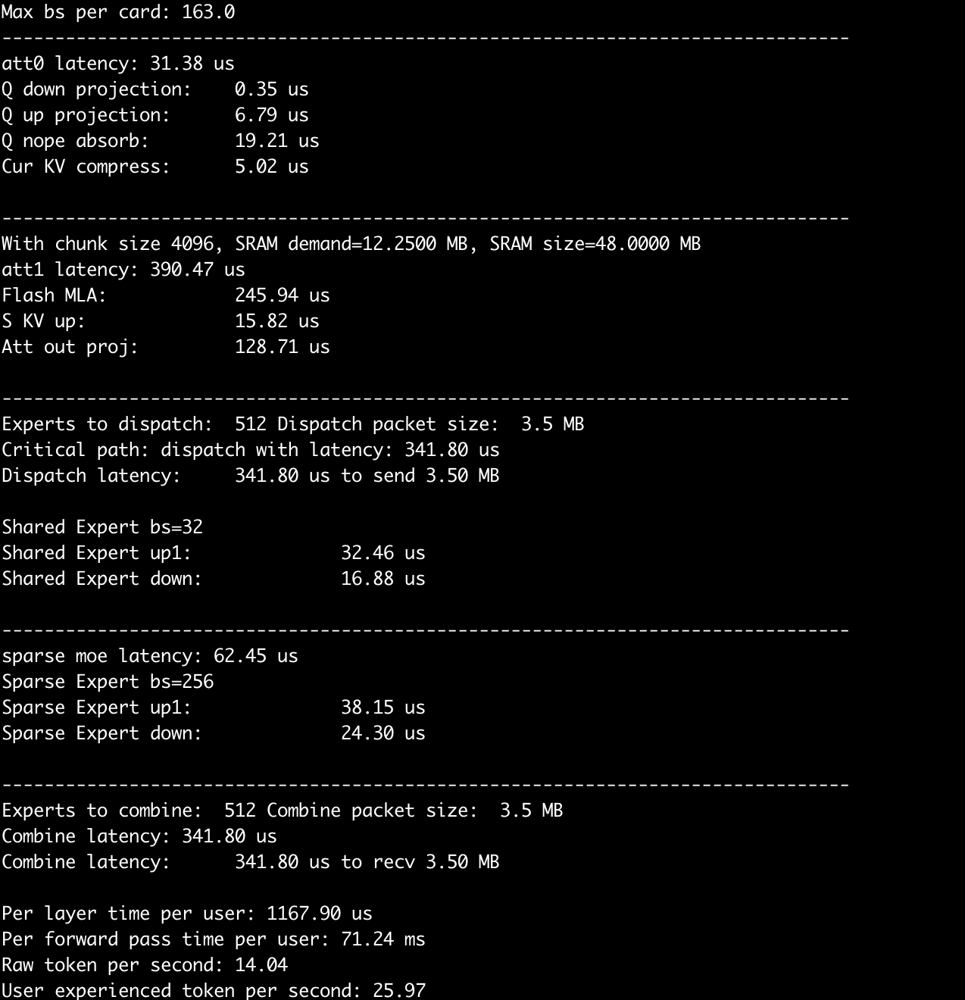

# 简介
与上一篇文章不同，本文主要目的是介绍模型的建模方法，以及搜索吞吐最大配置的方法。
TL;DR: H800、H20、A100、L20、L40S 的数据附在文末（不构成买卡建议）。

# 吞吐计算方法

本文采用的估算方法：
首先假设平均上下文长度为 5K （5K 上下文是参考 shen han 的文章：https://zhuanlan.zhihu.com/p/29841050824），
然后用 DRAM 容量作为约束，计算出最大的 batch size per card。
然后对单个 token 的延迟进行估算，得到单用户体验到 token per second。
最后计算单卡的吞吐 = batch size per card * 单用户体验到 token per second。

# 算法建模
为了简化，我只建模 Decoding 阶段，并且只计算稀疏层 （FFN 的 experts 多数为 routed expert 的层，一共 58 层） 的时间。
因为稠密层（FFN 全部为 shared expert 的层，一共 3 层） 占比很小，当前版本的模型直接用 sparse layer 的时间乘 61 层。

根据前期计算结果，下面几个算子/流水级在推理过程中时间占比最大。因此本模型对它们增加了可选的手动矫正，具体矫正方法在本小节后面介绍。

- FlashMLA
- 稀疏层 Dispatch 和 Combine 的时间
- FFN

其他的算子简单描述矩阵形状，让后用 Roofline 进行计算。

``` Python

    # Compute time if memory-bound (data transfer limited)
    memory_time = total_bytes / mem_bw

    # Compute time if compute-bound (FLOP limited)
    compute_time = total_flops / flops

    return max(memory_time, compute_time)
```

> Roofline 模型是一种用于分析计算程序性能上限的直观工具，通过结合硬件算力与内存带宽限制，揭示程序在不同计算密度下的性能瓶颈。

## FlashMLA MFU 矫正

> MFU：Model FLOPS Utilization = 模型推理过程所达到的 FLOPS / 硬件理论 FLOPS

我最初的矫正方法是乘上一个系数，使得最终的 flops 匹配 FlashMLA 公开的数据，后来感觉这么搞不是很靠谱。

仔细回忆了一下，在 [Flash attention V3 (FA3) 的论文](https://arxiv.org/abs/2407.08608)里，MFU 也不算很高。
文章解释说因为编译器重排、寄存器压力等原因，Attention 的 2 个 GEMM 和 1 个 Softmax 无法完全 overlap，
只有其中一个 GEMM 和 Softmax 能够完美掩盖：
<!-- insert picture -->


而理想情况下，下一代的推理芯片应该设计成这样：


我在建模硬件时，增加了 2 个参数：
``` Python

        self.two_stage_fa3 = False
        self.three_stage_fa3 = False
```
对于未来的理想的推理芯片，我设置 `three_stage_fa3 = True`；
对于 H800/H20，我设置 `two_stage_fa3 = True`；
对于 L20 等 Ada、Ampere 世代的卡，两个选项都是 `False`，因为直到 Hopper 才引入 wgmma.async，才能实现 FA3。

计算 MLA 时间的方法如下（与前面的两张图相对应）：
``` Python

        if hw.three_stage_fa3:
            compute_time = max(vector_time, all_gemms_time)
            not_overlapped_tensor_time = max(0, all_gemms_time - vector_time)
        elif hw.two_stage_fa3:
            compute_time = gemm_times[0] + max(vector_time, gemm_times[1])
            not_overlapped_tensor_time = gemm_times[0] + max(0, gemm_times[1] - vector_time)
        else:
            compute_time = all_gemms_time + vector_time
            not_overlapped_tensor_time = all_gemms_time
```

当然，为了得到一个更准确的 MFU，我们还可以考虑在此基础上增加额外的矫正。

此外，我不知道现在 CUDA 编译器有没有改进？H卡/B卡能不能实现 3-stage 的完美覆盖？
希望有相关信息的朋友在评论区或者 PM 戳我一下，我来观摩学习。

## FFN 矫正 

FFN 的 MFU 矫正可以参考 [DeepGEMM](https://github.com/deepseek-ai/DeepGEMM) 给出的数据。

具体地，在生成 MoE 的 GEMM 时，给每个 GEMM 标注 discount factor：
``` Python

    def moe_factory(self, bs, dense=False):
        up_dim = self.dense_internal_dim if dense else self.moe_internal_dim
        # There are 2 up_project matrix here, so we can concat them at the N dimension
        moe_up_x2 = MMOp(bs, self.hid_dim, up_dim*2, elem_size=1, acc_size=4, name="moe_up_x2")
        moe_down = MMOp(bs, up_dim, self.ffn_output_dim, elem_size=1, acc_size=4, name="moe_down")

        if not self.promo_discount:
            return moe_up_x2, moe_down

        # else: apply discount factor
        # using data from https://github.com/deepseek-ai/DeepGEMM
        if bs >= 1024:
            moe_up_x2.precision_promo_discount_factor=1233/1979
            moe_down.precision_promo_discount_factor=925/1979
        elif bs >= 512:
            moe_up_x2.precision_promo_discount_factor=1040/1979
            moe_down.precision_promo_discount_factor=916/1979
        elif bs >= 256:
            moe_up_x2.precision_promo_discount_factor=932/1979
            moe_down.precision_promo_discount_factor=815/1979
        elif bs >= 128:
            moe_up_x2.precision_promo_discount_factor=533/1979
            moe_down.precision_promo_discount_factor=510/1979
        else:  # using factor of 64
            moe_up_x2.precision_promo_discount_factor=287/1979
            moe_down.precision_promo_discount_factor=295/1979

        return moe_up_x2, moe_down
```

在计算 GEMM 延迟时，把 `precision_promo_discount_factor` 带入：

``` Python

    def mm_helper(hw: Hardware, op: MMOp, verbose=False):
    # Compute the latency of a matrix-matrix multiplication
    # op: MMOp
    # hw: Hardware
    # return: latency in seconds

    used_flops = hw.fp8_FLOPS if op.elem_size == 1 else hw.bf16_FLOPS

    discount_note = ""
    if op.other_discount_factor != 1:
        used_flops *= op.other_discount_factor
        discount_note = f" with other discount factor {op.other_discount_factor:.2f}"
    elif op.precision_promo_discount_factor != 1 and op.elem_size == 1 and hw.fp8_low_acc_precision:
        used_flops *= op.precision_promo_discount_factor
        discount_note = f" with precision promotion discount factor {op.precision_promo_discount_factor:.2f}"

```
上述代码有 2 点需要说明：

为什么是 `op.precision_promo_discount_factor != 1 and op.elem_size == 1 and hw.fp8_low_acc_precision` 这个条件？
因为我在思考一个问题：像 `M=4096	N=24576	K=1536` 这样形状的矩阵都跑不满 MFU，仅仅是因为形状差吗？
个人倾向于认为精度提升带来的损失也不少，因此
- 在追求吞吐、放弃精度的配置中，我假设可以关闭 DeepGEMM 的精度提升达到更高的 MFU，此时忽略 `precision_promo_discount_factor`
- 在未来的理想的硬件中，我假设 fp8 的累加精度足够，不需要做精度提升

`other_discount_factor` 则是为了满足手动调整 MFU 的需求，例如 Zartbot 就手动赋值 MFU=0.7。


# 网络建模

我根据 DeepEP 中的数据手动给网卡的有效带宽进行了赋值。其中 E810 不一定指具体的型号，只是为了代表一类较为便宜的 RoCE v2 网卡。

``` Python

class NIC:
    def __init__(self, name, bw):
        self.name = name
        self.bw = bw

class CX7(NIC):
    def __init__(self):
        super().__init__("CX7 400Gbps", 40 * 1024**3)

class E810(NIC):
    def __init__(self):
        super().__init__("E810 100Gbps", 10 * 1024**3)
```

RDMA 通信时间计算：
``` Python

def compute_combine_latency(self, nic_bw, bs):
    combine_elem_size = self.non_moe_elem_size
    experts_to_combine = bs*self.sparse_expert_per_token
    combine_packet_size = self.hid_dim * combine_elem_size * experts_to_combine
    comibine_lat = compute_rdma_latency(nic_bw, combine_packet_size)

def compute_rdma_latency(card_effective_bw, tx_bw):  # both in Bytes/s
    latency = tx_bw / card_effective_bw
    return latency
```

# GPU 建模

对建模 GPU 时用到的部分参数的解释：
- `fp8_FLOPS` 在 A100 这样的设备上用 int8 算力替代
- `exp2_FLOPS` 和 `reduce_FLOPS` 由 SM 里的功能单元数量决定，在 [CUDA 编程手册](https://docs.nvidia.com/cuda/cuda-c-programming-guide/) 里有具体的数值。这两个单元影响了 Softmax 的吞吐
- `thread_all_reduce_latency` 用于模拟不用的 AI core/SM 在 SoC 级别做 reduce 的时间，我不确定用来建模 GPGPU 是否合适，主要是用于指导我自己的芯片规格制定。但是这部分的建模还略微粗糙，我还需要再多审视一下
- `isolated_fp8_bf16` 理论上可以做一个芯片，fp8 和 bf16 是拆分开的。不过，这个参数现在没用上，忽略就好
- `sram_sz` 影响了 Flash Attention 每次能切多长的 sequence，这对矩阵的形状、softmax rescale 的次数有影响，但是这部分我建模的方式还比较粗糙

``` Python

class Hardware:
    def __init__(self, name):
        self.name = name
        self.mem_bw = 0
        self.bf16_FLOPS = 0
        self.fp8_FLOPS = 0
        self.exp2_FLOPS = 0
        self.reduce_FLOPS = 0
        self.thread_all_reduce_latency = 0.5 * 1e-6  # 0.5 us
        self.isolated_fp8_bf16 = False
        self.mem_sz = 0
        self.fp8_low_acc_precision = False
        self.sram_sz = 0
        self.two_stage_fa3 = False
        self.three_stage_fa3 = False
```
#	并行方式建模

我的模型不建模 TP，只建模简单的 DP 和 EP，因为我未来设计的芯片没有 NVLink。

EP 数量用于计算每张卡的 expert 数量：
``` Python

    def sparse_expert_per_card(self):
        return np.ceil(self.expert_count / self.ep_count)
```
`sparse expert` 就是大家常说的 `routed expert`

目前我建模了两种流水线：

- naive 流水线，不做任何 overlapping
- dual micro batch，就是官方公布的 EP144 所使用的 overlapping 方案

Naive 流水线计算时间是每一层的时间相加，而 dual micro batch 则是按照官方的方法来划分流水级。
目前 dual micro batch 的流水级划分在任何配置下都和官方公布的 EP144 的方式一致，没有做更多的设计空间探索。



计算 token 时延时，用一个关键路径时间乘上 micro batch 的次数：
``` Python

    def final_report(self, overall_lat, bs, micro_batch_count=1):
        overall_lat = overall_lat * micro_batch_count
        user_token_per_sec = 1 / (overall_lat * self.n_layers)
```

# 可选的参数配置

``` Python

        hist_len = 5 * Ki 
        cards = [H800(), H20(), A100(), L20(), L40S()]
        nics = [CX7(), E810()]
        for dev in cards:
            for nic in nics:
                for speculative_decode_len in [0, 1]:
                    for fa_chunk in [512*8]:
                        for kvc_sz, non_moe_param_sz, promotion in [(2, 2, False), (2, 2, True), (1, 2, True), (1, 2, False), (1, 1, False)]:
                            for policy in ['dual-mbatch', 'naive']:
                                for ep in [144, 320]:
```
参数解释：

- `cards` 和 `nic` 就是 GPU 和网卡，不展开介绍。
- `fa_chunk` 最开始是想建模 Flash attention 一次在片上能算多长的 sequence，它会影响矩阵的形状从而影响 MFU。
但是我还没来得及做……
- `kvc_sz` 是 KV cache 的元素大小，如果用 fp8 就是 1，如果用 bf16 就是 2。
`non_moe_param_sz` 是除了 Expert 之外的参数的元素大小，如果用 fp8 就是 1，如果用 bf16 就是 2。

    - 当这两个参数都为 2 时，就是 Deepseek 官方的配置。
    - 当 `kvc_sz=1, non_moe_param_sz=2` 时，KV cache 的容量需求和访存带宽需求减半，但是 flashMLA 仍然用 bf16 计算，用 GPU 的 bf16 flops 来估算时间。
    - 当 `kvc_sz=1, non_moe_param_sz=1` 时，flashMLA 改为用 fp8 计算。
- `promotion` 是指使用 DeepGEMM 中提供的数据来矫正 MFU 的。如果设为 `True`，MoE 计算时会对 GPU 的 fp8 flops 进行矫正，
（理论上 MLA 也应该做类似的矫正，我还没来得及加，我暂时还不知道矫正为多少比较合适……）。

## 推测解码
`speculative_decode_len` 是指利用 Deepseek 自带 eagle-like layer 进行推测解码的长度。

> 对计算机体系结构背景的同学，可以用分支预测器类比来理解LLM的推测解码（Speculative Decoding）：
推测解码相当于在语言模型推理时引入"分支预测+乱序执行"机制：用小模型（快速但低精度）预测未来token（类似分支预测器），用大模型（慢速但高精度）并行验证（类似ALU执行），通过验证命中率换取整体加速。区别在于，推测错误在 CPU 中会回滚流水线，而在 LLM 中则会占用额外的计算资源。

> eagle layer 是一种特殊的 Transformer 层，用大模型最后一层的 feature （属于第 N-1 个 token） 和预测出来的第 N 个 token
作为输入，再进行一次自回归解码。这种范式是目前准确率最高的推测解码方法。
eagle-like layer 是 Deepseek V3 里用到的结构，和 eagle layer 略有不同。

在端侧，`speculative_decode_len` 可以配置得很长，从而提升单用户的延迟。
在云侧，`speculative_decode_len` 一般设置为 0-1，因为云侧追求吞吐，而推测错误损失吞吐。

我在建模时设置 `q_seq_len = 1 + speculative_decode_len`，
增大该参数会增加 MoE 层的 batch size，增大 Attention Projection 的 batch size，增大计算 `qK^T` 时 q 矩阵的 M 维，
从而使得任务更加计算密集。
理论上，M 更大，矩阵计算的 MFU 更高，但是这一点我暂时没有建模。


`speculative_decode_len` 也会影响最终的“用户体验到的 TPS” 和有效吞吐：
``` Python

        # self.q_seq_len - 1 = speculative decode length
        speculation_success_token_count = 0
        for i in range(1, self.q_seq_len):
            speculation_success_token_count += pow(0.85, i)
        ux_tps = user_token_per_sec * (1 + speculation_success_token_count)
        print(f"User experienced token per second: {ux_tps:.2f}")
        throughput = user_token_per_sec * bs * (1 + speculation_success_token_count)/self.q_seq_len
```
其中 `0.85` 是 Deepseek V3 TR 里面给出的值，和目前 SOTA 的推测解码方法报告的数值相符（Eagle2、HASS 和 EAGLE-3）。

# 配置搜索

搜索的目标是最大化吞吐，约束是 Batch size 不能太大导致 DRAM 装不下 KV cache，如果爆了就降低 batch size。
第二个约束是 QoS 约束（ux_tps：user-experienced token per second），如果 `ux_tps < target_ux_tps` 就降低 batch size。

``` Python

    ux_tps = 0
    bs = 128 + 8

    while ux_tps < target_ux_tps and bs > 8:
        bs -= 8
        if policy == 'dual-mbatch':
            ds = DeepSeekV3(hist_len, 1 + speculative_decode_len, bs, fa_chunk=fa_chunk, kvc_elem_size=kvc_sz, non_moe_param_elem_size=non_moe_param_sz)
            ds.promo_discount = promotion
            ds.ep_count = ep
            if bs > ds.compute_max_bs_per_card_by_mem_size(dev):
                continue
            ux_tps, throughput = ds.model_dual_micro_batch_decode(bs, dev, nic.bw)
        else:
            assert policy == 'naive'
            ds = DeepSeekV3NaiveDecode(hist_len, 1 + speculative_decode_len, bs, fa_chunk=fa_chunk, kvc_elem_size=kvc_sz, non_moe_param_elem_size=non_moe_param_sz)
            ds.promo_discount = promotion
            ds.ep_count = ep
            if bs > ds.compute_max_bs_per_card_by_mem_size(dev):
                continue
            ux_tps, throughput = ds.model_naive_decode(bs, dev, nic.bw)

    if ux_tps >= target_ux_tps and bs > 8:
        perf_results.append([dev.name, nic.name, policy, ep, kvc_sz, non_moe_param_sz, bs, promotion, ux_tps, throughput, speculative_decode_len])

```

# 方案搜索结果

去重：
``` Python

   df = df.sort_values(by=['Throughput Per card'], ascending=False).drop_duplicates(subset=['GPU', 'NIC', 'EP', 'Non-expert param elem size'], keep='first')
```

TPS > 20 的方案：

| GPU  | NIC          | Pipeline policy | EP  | KVCache elem size | Non-expert param elem size | Batch size | MoE FP8 MFU discounted | User TPS (considering MTP) | Throughput Per card | Speculative Decode (MTP) Len |
|------|--------------|-----------------|-----|-------------------|----------------------------|------------|------------------------|----------------------------|---------------------|------------------------------|
| H800 | CX7 400Gbps  | dual-mbatch     | 320 | 1                 | 1                          | 128        | FALSE                  | 28.0091968                 | 3585.1772           | 0                            |
| H800 | CX7 400Gbps  | dual-mbatch     | 144 | 1                 | 1                          | 128        | FALSE                  | 26.0344247                 | 3332.40637          | 0                            |
| H800 | CX7 400Gbps  | dual-mbatch     | 320 | 2                 | 2                          | 128        | FALSE                  | 22.5000905                 | 2880.01158          | 0                            |
| H800 | CX7 400Gbps  | dual-mbatch     | 144 | 1                 | 2                          | 128        | FALSE                  | 21.2078334                 | 2714.60268          | 0                            |
| A100 | CX7 400Gbps  | dual-mbatch     | 320 | 1                 | 1                          | 88         | FALSE                  | 20.1407231                 | 1772.38364          | 0                            |
| A100 | CX7 400Gbps  | dual-mbatch     | 144 | 1                 | 1                          | 72         | FALSE                  | 21.5502166                 | 1551.61559          | 0                            |
| L40S | CX7 400Gbps  | naive           | 320 | 1                 | 1                          | 72         | FALSE                  | 21.4313983                 | 1543.06067          | 0                            |
| H800 | E810 100Gbps | dual-mbatch     | 320 | 1                 | 1                          | 72         | FALSE                  | 20.4423865                 | 1471.85183          | 0                            |
| H800 | E810 100Gbps | dual-mbatch     | 144 | 1                 | 1                          | 64         | FALSE                  | 21.9321703                 | 1403.6589           | 0                            |
| L40S | CX7 400Gbps  | naive           | 144 | 1                 | 1                          | 64         | FALSE                  | 21.0279269                 | 1345.78732          | 0                            |
| H20  | CX7 400Gbps  | naive           | 320 | 1                 | 1                          | 56         | FALSE                  | 21.157274                  | 1184.80734          | 0                            |
| A100 | E810 100Gbps | dual-mbatch     | 320 | 1                 | 1                          | 56         | FALSE                  | 20.9013985                 | 1170.47832          | 0                            |
| A100 | E810 100Gbps | dual-mbatch     | 144 | 1                 | 1                          | 48         | FALSE                  | 22.090205                  | 1060.32984          | 0                            |
| H20  | CX7 400Gbps  | naive           | 144 | 1                 | 1                          | 48         | FALSE                  | 20.9102045                 | 1003.68982          | 0                            |
| A100 | CX7 400Gbps  | dual-mbatch     | 320 | 1                 | 2                          | 48         | FALSE                  | 20.8779627                 | 1002.14221          | 0                            |
| H800 | E810 100Gbps | dual-mbatch     | 320 | 2                 | 2                          | 48         | FALSE                  | 20.5158572                 | 984.761146          | 0                            |
| H800 | E810 100Gbps | dual-mbatch     | 144 | 2                 | 2                          | 40         | FALSE                  | 23.4529525                 | 938.118101          | 0                            |
| A100 | CX7 400Gbps  | naive           | 144 | 2                 | 2                          | 40         | FALSE                  | 22.350959                  | 894.038361          | 0                            |
| L40S | E810 100Gbps | dual-mbatch     | 320 | 1                 | 1                          | 40         | FALSE                  | 21.0758909                 | 843.035638          | 0                            |
| H20  | E810 100Gbps | dual-mbatch     | 320 | 1                 | 1                          | 40         | FALSE                  | 21.0547374                 | 842.189497          | 0                            |
| L20  | CX7 400Gbps  | naive           | 320 | 1                 | 1                          | 40         | FALSE                  | 20.3841474                 | 815.365897          | 0                            |
| H20  | E810 100Gbps | dual-mbatch     | 144 | 1                 | 1                          | 32         | FALSE                  | 22.4026963                 | 716.886281          | 0                            |
| A100 | E810 100Gbps | dual-mbatch     | 320 | 2                 | 2                          | 32         | FALSE                  | 22.3788888                 | 716.124441          | 0                            |
| L40S | CX7 400Gbps  | naive           | 320 | 2                 | 2                          | 32         | FALSE                  | 21.9294518                 | 701.742459          | 0                            |
| L20  | CX7 400Gbps  | naive           | 144 | 1                 | 1                          | 32         | FALSE                  | 21.3915352                 | 684.529125          | 0                            |
| L40S | E810 100Gbps | naive           | 144 | 1                 | 1                          | 32         | FALSE                  | 21.2905802                 | 681.298565          | 0                            |
| A100 | E810 100Gbps | dual-mbatch     | 144 | 2                 | 2                          | 32         | FALSE                  | 21.0465664                 | 673.490126          | 0                            |
| L40S | CX7 400Gbps  | naive           | 144 | 1                 | 2                          | 32         | FALSE                  | 20.2387757                 | 647.640821          | 0                            |
| H20  | CX7 400Gbps  | naive           | 320 | 2                 | 2                          | 24         | FALSE                  | 23.085745                  | 554.057879          | 0                            |
| L20  | E810 100Gbps | naive           | 320 | 1                 | 1                          | 24         | FALSE                  | 22.2550264                 | 534.120633          | 0                            |
| H20  | CX7 400Gbps  | naive           | 144 | 1                 | 2                          | 24         | FALSE                  | 21.5116317                 | 516.279161          | 0                            |
| L20  | E810 100Gbps | naive           | 144 | 1                 | 1                          | 24         | FALSE                  | 20.4482826                 | 490.758782          | 0                            |
| H20  | E810 100Gbps | naive           | 320 | 2                 | 2                          | 16         | FALSE                  | 22.2062143                 | 355.299429          | 0                            |
| L40S | E810 100Gbps | naive           | 320 | 1                 | 2                          | 16         | FALSE                  | 22.1774847                 | 354.839755          | 0                            |
| H20  | E810 100Gbps | naive           | 144 | 2                 | 2                          | 16         | FALSE                  | 21.2108982                 | 339.374371          | 0                            |
| L40S | E810 100Gbps | naive           | 144 | 2                 | 2                          | 16         | FALSE                  | 20.6426767                 | 330.282827          | 0                            |

TPS > 15 的方案：

| GPU  | NIC          | Pipeline policy | EP  | KVCache elem size | Non-expert param elem size | Batch size | MoE FP8 MFU discounted | User TPS (considering MTP) | Throughput Per card | Speculative Decode (MTP) Len |
|------|--------------|-----------------|-----|-------------------|----------------------------|------------|------------------------|----------------------------|---------------------|------------------------------|
| H800 | CX7 400Gbps  | dual-mbatch     | 320 | 1                 | 1                          | 128        | FALSE                  | 28.0091968                 | 3585.1772           | 0                            |
| H800 | CX7 400Gbps  | dual-mbatch     | 144 | 1                 | 1                          | 128        | FALSE                  | 26.0344247                 | 3332.40637          | 0                            |
| H800 | CX7 400Gbps  | dual-mbatch     | 320 | 2                 | 2                          | 128        | FALSE                  | 22.5000905                 | 2880.01158          | 0                            |
| H800 | CX7 400Gbps  | dual-mbatch     | 144 | 1                 | 2                          | 128        | FALSE                  | 21.2078334                 | 2714.60268          | 0                            |
| A100 | CX7 400Gbps  | dual-mbatch     | 320 | 1                 | 1                          | 120        | FALSE                  | 15.3452078                 | 1841.42494          | 0                            |
| L40S | CX7 400Gbps  | dual-mbatch     | 320 | 1                 | 1                          | 112        | FALSE                  | 15.1610446                 | 1698.03699          | 0                            |
| A100 | CX7 400Gbps  | dual-mbatch     | 144 | 1                 | 1                          | 104        | FALSE                  | 15.6435057                 | 1626.92459          | 0                            |
| L40S | CX7 400Gbps  | naive           | 144 | 1                 | 1                          | 96         | FALSE                  | 15.5360111                 | 1491.45707          | 0                            |
| H800 | E810 100Gbps | dual-mbatch     | 320 | 1                 | 1                          | 96         | FALSE                  | 15.4487018                 | 1483.07537          | 0                            |
| H800 | E810 100Gbps | dual-mbatch     | 144 | 1                 | 1                          | 88         | FALSE                  | 16.2383275                 | 1428.97282          | 0                            |
| H20  | CX7 400Gbps  | dual-mbatch     | 320 | 1                 | 1                          | 80         | FALSE                  | 15.7806051                 | 1262.44841          | 0                            |
| A100 | E810 100Gbps | dual-mbatch     | 320 | 1                 | 1                          | 80         | FALSE                  | 15.3096943                 | 1224.77555          | 0                            |
| A100 | CX7 400Gbps  | dual-mbatch     | 320 | 2                 | 2                          | 72         | FALSE                  | 15.7125962                 | 1131.30693          | 0                            |
| A100 | E810 100Gbps | dual-mbatch     | 144 | 1                 | 1                          | 72         | FALSE                  | 15.6261954                 | 1125.08607          | 0                            |
| H20  | CX7 400Gbps  | naive           | 144 | 1                 | 1                          | 64         | FALSE                  | 16.2605462                 | 1040.67496          | 0                            |
| A100 | CX7 400Gbps  | dual-mbatch     | 144 | 2                 | 2                          | 64         | FALSE                  | 16.0946133                 | 1030.05525          | 0                            |
| L40S | E810 100Gbps | dual-mbatch     | 320 | 1                 | 1                          | 64         | FALSE                  | 15.9967223                 | 1023.79023          | 0                            |
| H800 | E810 100Gbps | dual-mbatch     | 320 | 1                 | 2                          | 64         | FALSE                  | 15.50465                   | 992.297597          | 0                            |
| H800 | E810 100Gbps | dual-mbatch     | 144 | 2                 | 2                          | 64         | FALSE                  | 15.050102                  | 963.206531          | 0                            |
| H20  | E810 100Gbps | dual-mbatch     | 320 | 1                 | 1                          | 56         | FALSE                  | 16.2170954                 | 908.157343          | 0                            |
| L40S | CX7 400Gbps  | naive           | 320 | 1                 | 2                          | 56         | FALSE                  | 15.8860772                 | 889.620324          | 0                            |
| L40S | E810 100Gbps | dual-mbatch     | 144 | 1                 | 1                          | 56         | FALSE                  | 15.4127536                 | 863.1142            | 0                            |
| L20  | CX7 400Gbps  | naive           | 320 | 1                 | 1                          | 56         | FALSE                  | 15.3954561                 | 862.145543          | 0                            |
| A100 | E810 100Gbps | dual-mbatch     | 320 | 2                 | 2                          | 56         | FALSE                  | 15.0801803                 | 844.490097          | 0                            |
| H20  | E810 100Gbps | dual-mbatch     | 144 | 1                 | 1                          | 48         | FALSE                  | 16.4153222                 | 787.935466          | 0                            |
| L40S | CX7 400Gbps  | naive           | 144 | 1                 | 2                          | 48         | FALSE                  | 16.3139485                 | 783.069527          | 0                            |
| A100 | E810 100Gbps | dual-mbatch     | 144 | 1                 | 2                          | 48         | FALSE                  | 16.1040035                 | 772.99217           | 0                            |
| L20  | CX7 400Gbps  | naive           | 144 | 1                 | 1                          | 48         | FALSE                  | 15.4184655                 | 740.086342          | 0                            |
| L20  | E810 100Gbps | dual-mbatch     | 320 | 1                 | 1                          | 40         | FALSE                  | 15.960334                  | 638.413362          | 0                            |
| H20  | CX7 400Gbps  | naive           | 320 | 1                 | 2                          | 40         | FALSE                  | 15.9069005                 | 636.276019          | 0                            |
| H20  | CX7 400Gbps  | naive           | 144 | 2                 | 2                          | 32         | FALSE                  | 17.4708145                 | 559.066064          | 0                            |
| L20  | E810 100Gbps | dual-mbatch     | 144 | 1                 | 1                          | 32         | FALSE                  | 16.3150907                 | 522.082902          | 0                            |
| L40S | E810 100Gbps | dual-mbatch     | 320 | 1                 | 2                          | 32         | FALSE                  | 15.4290296                 | 493.728946          | 0                            |
| H20  | E810 100Gbps | dual-mbatch     | 320 | 2                 | 2                          | 32         | FALSE                  | 15.1122811                 | 483.592996          | 0                            |
| L40S | E810 100Gbps | naive           | 144 | 2                 | 2                          | 24         | FALSE                  | 16.5418484                 | 397.004362          | 0                            |
| H20  | E810 100Gbps | dual-mbatch     | 144 | 2                 | 2                          | 24         | FALSE                  | 16.4071918                 | 393.772603          | 0                            |


*本文同步发表于 [ShineZ的博客](https://shinezyy.github.io/ArchShineZ/post/modeling-deepseek/)，因为是用 Markdown 转换为 Word 之后发布到知乎，知乎文章的排版可能略有瑕疵。*
