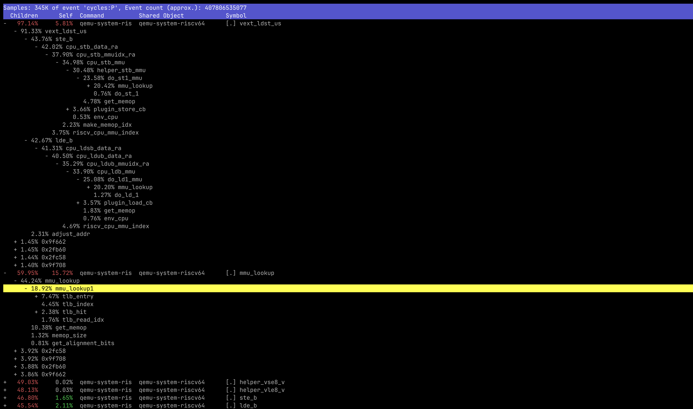

# 简介
虽然目前已经有多个实现了 RISC-V Vector 1.0 的 ISA 模拟器，例如 Spike，QEMU 和 NEMU，但是这些实现的速度尚不足以满足高效的软硬件协同设计的需求。
为了将软件修改、编译器修改后的性能反馈时间缩短到一天以内，我们对 NEMU 的 RISC-V Vector（RVV）实现进行了优化。
我们克服了原有模拟器中存在的以下性能问题：
1) 对地址的冗余计算、检查和翻译；
2) 利用控制流来实现掩码操作，导致宿主机分支预测错误较为频繁。

我们用位运算来实现掩码操作，并尽力避免代码中出现 unbounded 的循环，
使得编译器（GCC11）能将代码自动向量化，从而利用 X86 的 AVX 指令进行 RVV 的模拟。

最终，我们在 NEMU 上仿真 `h264_sss` 时 获得了 131 MIPS 的仿真速度，作为对比，而 QEMU 的速度不超过 7 MIPS。
我们的方法不局限于 RISC-V Vector 指令集，也可以用于优化 ARM SVE 等其他向量指令集的模拟。

目前，本优化已经合入 NEMU 的主分支：[rv64v: fast path for unit-stride ld/st; vectorize this fast path](https://github.com/OpenXiangShan/NEMU/pull/446)。

# 背景

## 指令集模拟器

指令集模拟器可以用于 1）调试软件；2）在处理器设计早期搭建原型平台；3）作为硬件设计的参考模型。
此外，我们团队还将指令集模拟器用于检查点生成：从程序中寻找有代表性的片段，
在 RTL 或者架构模拟器上运行这些片段，以缩短性能评估的时间。

作为调试软件和检查点生成器时，我们对指令集模拟器的性能要求较高，最好能达到 100 MIPS 以上。
常见的指令集模拟器，例如 Spike 和 QEMU，它们的模拟速度都在该量级，足以满足我们的需求。
但是，RISC-V Vector （RVV）给指令集模拟器带来了新的挑战：
一条 RVV 指令可能包含了对数百甚至数千个元素的操作，
使得模拟执行单条指令的时间大幅增加。

## 向量指令集

为了提供更灵活、更大粒度的单指令多数据（SIMD）操作，ARM 和 RISC-V 都提出了各自的向量指令集。
不同于传统的 SIMD 指令集，单个 RISC-V 向量指令集能操作最多高达256Byte的数据，
这使得向量指令集能在科学计算、AI 等领域发挥更大的作用。

## 自动向量化

自动向量化是编译器将标量代码转换为向量代码的过程，
GCC 和 llvm 都不同程度地支持了自动向量化。
但是目前的向量指令集模拟器的实现并没有考虑到利用自动向量化。

## 指令集模拟器的地址翻译优化

我们发现在仿真`h264`的前 2G 指令时，QEMU 的速度只有约 2 MIPS，而 NEMU 可以达到 8 MIPS。
下图是 QEMU 运行 `h264` 时的 perf report，可以看到 91% 的时间都花在了 `vext_ldst_us` 上。
其中，44% 的时间花在了 `mmu_look_up`。

我们阅读代码发现，QEMU 的 MMU 实现并不高效，这可能与 QEMU 要考虑更多的指令集、访存模式、页面大小有关。
例如对 TLB 的访问的 common path 上需要进行多次链式访存：

为此，余子濠博士在 NEMU 中实现了一个更高效的 MMU，从 guest 的虚地址到 host
的虚地址的转化的 common path 只需要执行如图所示的几行代码。

# 动机

即使如此，NEMU 的仿真速度也远远无法满足我们的软硬件迭代需求：
完整运行 `SPECCPU 2006` 的 `h264` 需要约 18h，生成一次 checkpoint 需要运行 2 次（36h），
这使得 day 1 对软件/编译器/编译选项的一次修改要等到 day 3 才能得到性能反馈。

我们发现，所有的指令集模拟器的 RVV 模拟速度都远低于 100 MIPS 的根本原因是
他们对 `RVV` 的实现都将向量指令拆分到元素粒度进行模拟。
而高性能处理器处理部分向量指令时，在元素之间都是并行处理的。
例如香山处理器昆明湖架构的向量寄存器宽度为 128 bit，
一次可以处理 16 个 8 bit 的访存请求，
在处理 unit stride 这样的数据在内存和寄存器堆中都连续的指令时，只需要一个 uop 即可完成 16 个访存。
也就是说，指令集模拟器对这一类指令的实现比硬件更低效。

在元素粒度进行模拟导致了以下问题：
1) 目前所有的实现都为每一个元素进行了权限检查和地址翻译，这在大部分情况下是不必要的；
2) 用控制指令实现掩码操作导致了难以预测的分支，从而产生了更多的分支预测错误；
3) 低位宽的操作没有充分利用宿主机的计算宽度（经常使用 64 bit 的运算单元模拟 8 bit 的操作）。

# 优化

针对上述问题，我们给出了以下优化思路：
1) 对于数据在内存中连续的指令，在 TLB hit 且不跨页的情况下只进行一次地址翻译和权限检查；
2) 用位运算来手动实现掩码操作，避免引入数据依赖的控制流，并使得代码更容易被自动向量化；
3) 尽可能使用 bounded loops，使得循环更容易被自动向量化。

# 实验

## Setup

我们运行测试的机器是 7950x3d。
我们进行性能测试的对象是 SPECint 2006 中可以自动向量化的子项，`h264` 。
用于编译 SPECCPU 2006 的工具链是 RISC-V GCC 15，仅修改了 cost model 来适配香山处理器。
用于编译 NEMU 的工具链是 GCC 11 ……emmm，为什么用这个版本一言难尽，不过应该对实验结果影响不大。
为了方便获取数据，我们在做性能 breakdown 时使用仿真前 2G 指令的数据。
在头对头比较时，我们会报告完整运行 `h264` 的仿真时间。

## 代码对比

如图所示，在原本的 NEMU 中，掩码生成逻辑通过 `continue` 实现（红框），
并且为每一个元素生成一个访存操作（`rtl_lm`），每次操作中都会包含权限检查和地址翻译。

而在重写后的快速 `vle/vse` 中，我们只处理 TLB hit 且不跨页的情况，
在进行一次翻译之后，我们就能拿到访存操作对应的 host 地址，
这部分就不展开。
然后，我们根据 eew 生成和数据位宽一样宽的掩码操作
（我感觉这里有更简洁的写法，不过 CoPilot 生成出来我就不想管了）：

最后，我们用生成的全位宽掩码手动实现 `RVV` 的掩码功能，并 `memcpy` 到寄存器堆/内存。
注意，这里的 `RVV_AGNOSTIC` 是静态确定的，因此这里的 `if-else` 不会生成对应的分支指令。

**汇编代码赏析**，好吧，前面的 C 代码都可以不看，主要是想秀一下汇编，编译选项需要开启`-flto -ftree-vectorize -march=native`。
这里是全位宽掩码生成的一部分代码：

下面是掩码操作部分，改为了 bounded loop 之后就可以向量化：

## 头对头性能比较

## 性能 breakdown

然后，我们对性能收益的来源进行分析，发现性能收益来自 3 方面：
1) 显而易见的是，更少的权限检查和地址翻译；
2) 向量化提高了代码密度；
3) 更少的分支预测错误。

我们将 NEMU 分为 3 种版本：
1) baseline：优化前的 NEMU；
2) vectorizable：优化后的 NEMU，但是没有开启自动向量化 `-ftree-vectorize`；
3) vectorized：优化后的 NEMU，开启了自动向量化。

上图表明，即使未经自动向量化，在 h264_sss 的开始 2G 指令中，
我们的优化可以让 NEMU 的速度提升到原来的 4 倍。
而开启自动向量化则可以让性能提升到 6 倍。
减少权限检查、减少地址翻译和自动向量化的性能收益是显而易见的，这里我们不再展开。

前面提到过：我们用位运算实现了掩码操作，从而避免引入数据依赖的控制流。
通过对 `branch-misses` 的统计，我们可以看到在旧版代码中，有大约 610M 的分支预测错误。
对 `branch-misses` 的贡献中，`vst` 排第一，`isa_mmu_check` 排第二。
其中，在 `vst` 内部，实现掩码相关操作的 `continue` 贡献了全局 10% 的分支预测错误。

作为对比，我们的优化后的代码中，`branch-misses` 降低到了约 330M：

# 致谢

NEMU 的主体框架由余子濠博士完成，RVV 的大量实现由张梓悦同学完成。
笔者仅完成了针对 RVV 访存的 common case 的优化工作。

*本文同步发表于 [ShineZ的博客](https://shinezyy.github.io/ArchShineZ/post/nemu-v/)。因为是用 Markdown 转换为 Word 之后发布到知乎，知乎文章的排版可能略有瑕疵。*