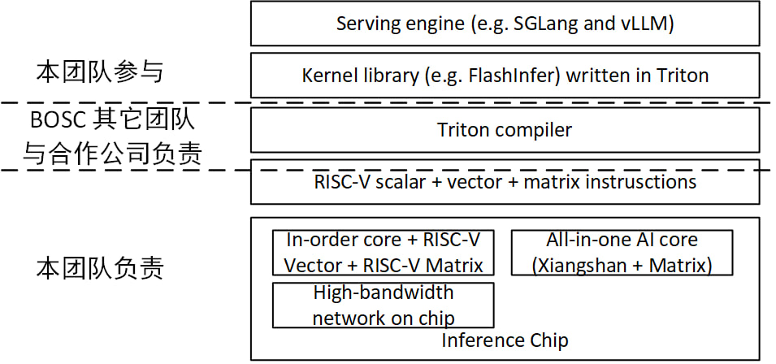
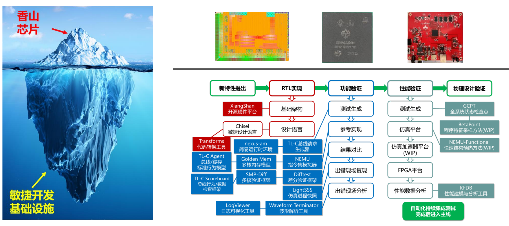

# BOSC 的推理芯片项目做什么

BOSC 会负责两部分的工作：1）RISC-V AI 推理的软件生态建设；2）开源的 RISC-V AI 推理芯片设计。

# 我和我的团队负责什么

我们目前的团队由香山处理器团队的骨干和中科院计算所的课题组成员组成。
我们团队负责 RISC-V AI 推理芯片设计，包括基于 RISC-V 矩阵扩展的计算核和高带宽互联网络，
此外，我们计划基于香山开发 all-in-one 高性能 AI 处理核。
我们会基于这些基础模块搭建推理速度超过 **100 TPS** (70B 模型)的系统级解决方案。

<!-- include ai-stack.jgp -->

## Infra matters

开发香山处理器的经验告诉我们，微架构和电路设计只是**冰山一角**，
为了支撑架构演进，**冰山下面**的工具是电路设计的根基。
在推理芯片项目中，我们也会搭建支持推理芯片演进的工具，
包括高层次架构模拟器、ISA 模拟器、RTL 仿真框架、采样工具和性能分析套件。
因为 LLM 推理巨大的计算量，我们需要前所未有的性能探索和仿真工具，包括：
- 模拟速度**超过 QEMU 100 倍的** ISA 模拟器
- 电路仿真速度**超过 VCS 200 倍的** RTL 仿真框架

<!-- fig: 冰山 -->

## Software matters

除了芯片设计外，我们团队还会一定程度地参与 kernel library 和 serving engine 的开发。
在过去 1-2 年中，我们看到 LLM 推理速度的提升多数来自软件优化，
例如 flash attention，chunked prefill 和 speculative decoding。
因此，推理芯片需要更好的服务于算法、算子和服务引擎才能获得更好的性能，
推理芯片团队必须深刻理解软件各层次的任务和需求。

# 我们需要怎样的人才

对于有科研经历或者工业界经历的朋友，我们需要这些方面的经验：

1) CPU/GPU/AI 加速器架构设计
2) 软件与硬件协同设计，尤其是算法与硬件协同设计

对于没有相关经历的应届生，我们希望你拥有扎实的计算机体系结构和编程基础，具体来说

1) 经历过[一生一芯](https://ysyx.oscc.cc/) 或类似的训练 （CPU 设计和 ISA 模拟器设计）
2) 熟练使用 Verilog/Chisel/C++，debug 能力强。
3) 掌握 Python、Bash 等脚本语言。
4) 能熟练使用搜索引擎和 LLM 等工具解决问题，以及从stackoverflow、mailing list、社区issue里面寻找答案。

在此基础上，以下方面是加分项

1) 深入理解 Transformer 等算法
3) 深入理解并行计算，有 CUDA/Triton 编程经验
3) 深入理解操作系统，扎实完成 MIT6.828/MIT6.S081 等实验课

## 联系方式
邮箱：archshinez AT outlook DOT com