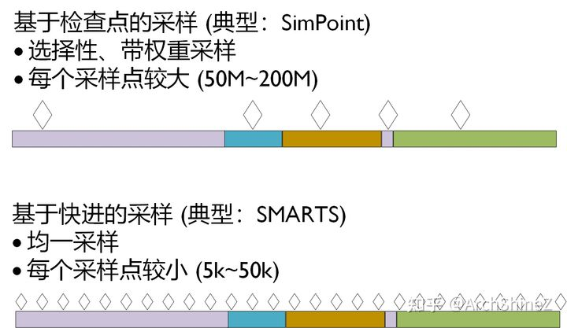
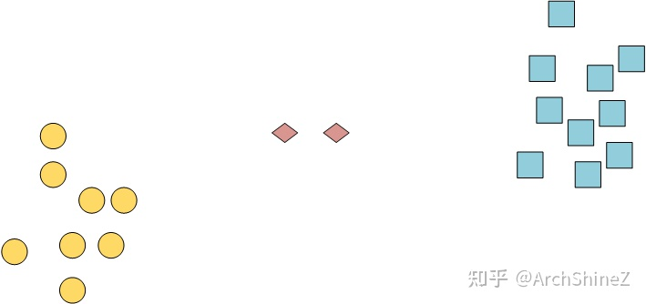
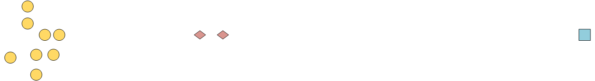

# 关于SimPoint的一些碎碎念

SimPoint是体系结构研究的重要工具，获得了2017年的ASPLOS Influential Paper  Award。从涉及的领域来看，它用了程序分析和机器学习的工具来解决体系结构的问题。能在2000左右就掌握了这些跨领域的工具，并且用到合适的任务上，作者的功底可以说是非常深厚了。

本文前半部分科普SimPoint，后半部分写一些个人见解，不定期更新。

首先，在模拟器上做程序采样的最主流的两个流派如下：

对选择性采样而言，怎么选就是最关键的问题。SimPoint的答案是把程序切成片段，每一个片段有他们的feature，对这些片段进行聚类。SimPoint认为一个cluster里的片段是相似的，用聚类最靠近中心点或者其它指标来选最有代表性的片段。一个cluster有多大，这个片段的权重就多大。

那么feature是什么？—— 基本块向量 (Basic Block Vector,  BBV)。BBV是一个向量，这个向量的每一维表示某程序运行时进入一个基本块的次数。BBV表示了片段的什么特性呢？比如一个片段总是调用一个函数，那么这个函数的第一个基本块对应的维的数值就会比较大。再比如一个分支总是跳，那么总是跳的那个基本块的数值就会比较大。如果两个片段在同一个分支或者函数调用上的数值相似，那么他们的执行路径就会比较相似，很直觉地，他们的行为也会相似。

将一维上的相似扩展为多维的相似，那就是欧几里得距离接近。所以，符合直觉地，SimPoint用k-means作为聚类算法。（当然，也有用其它聚类算法的，改日补上引用）

总结一下，SimPoint用程序片段的BBV作为feature，然后对BBV进行聚类，找到“有代表性”的片段。

+++

下面是吐槽，有一些入门级的错误，也有大师级的错误……

## 用别人选择的Simulation Points意味着什么

我看见有人在社交网站上请求别人发SimPoint选好的点给他，这是一个入门级错误。这肯定是不行的，因为两边的Binary很可能不一样，受到程序版本、编译器版本、优化选项、库的版本的影响。A这边的第N个片段和B的第N个片段很可能不是同一个片段。

## 用一个Simulation Point意味着什么

不止一个国外搞体系结构的教授跟我说过，大家研究的时候经常只用一个点，甚至有人说把maxK设为1？？？他们都是publication很厉害的star或者rising star，我非常震惊。

当我们把kmeans的maxK设为1的时候，是在做什么？找最靠近中点的那个点。这种做法会选择出不具有代表性的点。比如图2里，会选到红色菱形，而不是蓝色或者黄色。图3里更离谱，因为有一个蓝色的outliner，中点就会被“扯”到靠近红色菱形那个地方。

所以，如果真的无法接受更多的Simulation Points，那么把maxK设大一点，然后选权重大的片段，也比maxK=1要好。

+++

还在思考一些问题：

### 有必要降维吗？

### 当BBV维度非常高，且很多维的方差都比较大，且maxK被迫设置比较小时，SimPoint的物理意义是否就变弱了？

有空补上