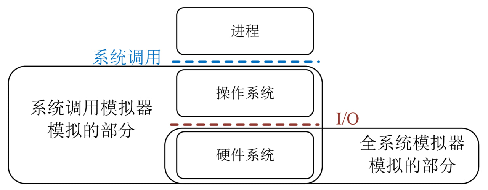

最近，我们意识到让用户搞定香山处理器仿真环境是一件非常困难的事情。

困难来自多方面，其中一个重要原因就是我们的各个仿真平台都选择了全系统模拟（香山RTL和香山GEM5）。
全系统（Full system，FS）模拟是一种模拟器的模式，与之相对的是系统调用模拟（System call emulation，SE）。

系统调用模拟（SE）是一种对用户非常便利的模式，用户只需要提供应用的可执行文件就可以直接运行。
但是SE对模拟器开发者带来了更多的负担。
以GEM5模拟器的SE模式实现为例，GEM5劫持了各个指令集的系统调用指令，然后用C/C++代码在宿主机模拟了这些Linux的系统调用。
如图所示，SE模拟器既实现了一部分硬件的功能（大部分指令的执行），又实现了一部分OS的功能（系统调用）。
SE模拟器与应用交互的界面是**指令集**和**系统调用**。
而在全系统（FS）模式下，模拟器模拟的仅仅是硬件系统，用户需要提供完整的系统镜像。
模拟器与软件（操作系统+应用程序）交互的界面是**指令集**和**输入输出（I/O）**。

在常见的模拟器中，GEM5 和 QEMU 能同时支持FS和SE两种模式，
GEM5 和 QEMU的开发者为此付出了大量的努力。
但是在RTL仿真中实现SE模式几乎不可能，因为RTL仿真的目标是模拟硬件，
可以支持SE的RTL必然是不可综合的。

此外，全系统模式的也有其优势：1) 拥有完整Linux系统调用，可以运行各种大型程序；
2) 对硬件系统而言，可以准确地建模虚存系统、I/O带来的性能影响。
而代价则是用户需要准备完整的系统镜像，其中镜像包括了bootloader、内核和应用程序。
为了保证性能评估的准确性以及降低移植软件的难度，香山处理器和香山GEM5选择了全系统模式。

我们发现全系统模拟对用户构成了阻碍：
虽然我们提供了构建系统镜像的文档，并多次修改，但是我们发现用户仍然会遇到各种问题。例如：
- 有的报错与指令集扩展或者操作系统ABI有关，在我们团队内部从来没有遇到过，即使是我们自己也需要较长时间解决。
- 用户对全系统模拟的概念不理解，希望从模拟器的命令行直接给应用程序传命令行参数（其实只有SE模拟器支持）。
- 用户对Linux系统不熟悉，例如不会装库。
- 用户编译应用程序的参数不恰当。

究其原因，一方面是构建镜像的复杂性不低，容易出现问题；另一方面是香山用户的知识背景非常多样。
为了适应更多用户，我们制作了本次视频教程，帮助用户生成全系统模拟的SPECCPU和checkpoint。
该视频的内容包括
- 构建RISC-V的Linux系统和bootloader
- 编译SPECCPU 2006
- 将SPECCPU 2006和Linux系统打包生成镜像
- 用NEMU模拟器运行镜像，进行SimPoint profiling 和生成checkpoint

责任声明：
- 本视频教程仅适用于香山处理器全系统环境的SPECCPU 2006的checkpoint构建，提供有限的社区支持。
- 使用本虚拟机只是权宜之计，我们仍然鼓励有相关知识背景的用户根据我们的文档自己搭建环境，以便获得更大的灵活性。
如果要构建其它大型程序，希望用户自己搭建环境，我们不通过虚拟机镜像提供相关支持。