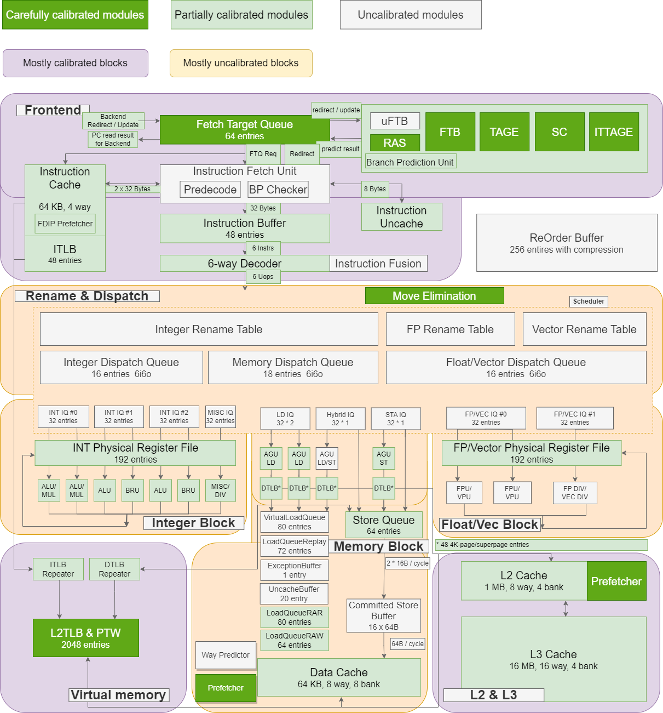

# 引言

本文的目的是帮助有一定CPU微架构基础但是不了解XS-GEM5项目的朋友初步认识XS-GEM5。针对各部分微架构设计的介绍还在持续更新中。

本文会对比说明XS-GEM5与上游GEM5的区别、XS-GEM5的架构与昆明湖RTL的区别。本文会对比以下几点：

-   模拟/仿真的功能支持
-   ISA支持
-   CPU流水线前端架构
-   CPU流水线后端架构
-   访存子系统架构

# XS-GEM5简介

XS-GEM5与香山处理器的昆明湖架构同时开始开发，其目的是提高香山处理器的架构探索效率，帮助昆明湖架构达到SPECint2k6
15/GHz的性能。

理论上，1）在进行架构探索之前，需要精准地将架构模拟器与RTL进行对齐；2）架构模拟器的微架构设计应该领先于RTL。实际上，出于项目进展的考虑，目前XS-GEM5与RTL主要对齐了流水线前端架构（包括分支预测器、取指流水线），后端指令调度执行引擎的延迟和计算带宽，缓存访问延迟和带宽，缓存预取和替换算法。

下图展示了截至现阶段（2024年1月），XS-GEM5与RTL的模块对齐程度，其中对齐程度较高的模块用绿色标注，未对齐或差异较大的模块用灰色标注。整体上，XS-GEM5对流水线前端和缓存子系统的对齐程度较高。而在2024年，我们会加强流水线后端的对齐。

## 性能对比

 |                    | 上游GEM5        |XS-GEM5           | 香山昆明湖RTL      |
 | -------------------| ----------------| -----------------|  -----------------|
 | SPECint2k6/GHz     | \<10            | 15.5             |  14.9              |
 | SPECfp2k6/GHz      | \<9             | 16.5             |  14.5              |

XS-GEM5相对于上游GEM5，在性能方面有较大优势，性能提升主要来自访存子系统的大量改进，解耦流水线前端和分支预测器bug
修复。

## 模拟/仿真的功能支持

|                   | 上游GEM5        |XS-GEM5           | 香山昆明湖RTL      |
| ------------------| ----------------| -----------------|  -----------------|
| Difftest          |                 | Y                | Y                 |
| RVGCpt            |                 | Y                | Y                 |
| Fastforward       | Y               | Y                |                   |
| Functional warmup | Y               | Y                | Experimental      |
| M5 checkpoint     | Y               |                  |                   |
| SimPoint profiling| Y               |                  |                   |
| SimPoint take cpt | Y               |                  |                   |
| SystemCall Emulation  | Y           | Partial          |                   |
| Topdown analysis  |                 | Y                | Y                 |
| Accelerate simulation with PGO   |  | Y                |                   |

## ISA支持
|                   | 上游GEM5        |XS-GEM5           | 香山昆明湖RTL      |
| ------------------| ----------------| -----------------|  -----------------|
| Non-RISCV ISAs     | Y               |                  |                   |
| RISCV Vector       | Partial         | RVV 1.0          | RVV 1.0 partial   |
| RISCV GCB          | Partial         | Y                | Y                 |
| RISCV H            | ?               | Y                | Y                 |
| CSR instruction implementation  | 50分？ | 60分？        | 70分？            |
| RISCV zcond        | ?               | Y                |                   |
| RISCV zbt          | ?               | Y                |                   |

## CPU流水线前端架构

|                   | 上游GEM5        |XS-GEM5           | 香山昆明湖RTL      |
| ------------------| ----------------| -----------------|  -----------------|
| Decoupled frontend|                 | Y                | Y                 |
| Fetch directed prefetching   |                 | Y                | Y                 |
| Fetch target buffer |                 | Y                | Y                 |
| Performance of TAGE Broken SCL branch predictor |   Broken              | Y                | Y                 |
| Performance of return addr stack |   +              | ++                | ++                 |

## CPU流水线后端架构

|                  | 上游GEM5        |XS-GEM5           | 香山昆明湖RTL      |
| -----------------| ----------------| -----------------|  -----------------|
| 指令调度、执行延迟  |                | 与RTL对齐          |                   |
| 集中式保留站      | Y               | Y                 |                   |
| 分布式保留站      |                    | Ongoing           | Y                 |
| 发射后读寄存器堆  | Y               | Y                 | Y                 |
| 发射前读寄存器堆  |                    |                    | Y                 |
| 真-推测执行       |                    | Ongoing           | Y                 |
| 访存依赖预测算法  | Basic storeset with perf bug | Storeset supporting multi producer   | Storeset supporting multi producer |
| FMA拆分执行       |                    | Y                 | Y                 |
| ROB压缩          |                    |                    | Y                 |
| Move elimination |                    | Y                 | Y                 |
| Recover policy   | Rollback only    | Rollback or replay| Rollback or replay|
| Renaming Vector misc register |        | Y                 | Y                 |

## 访存子系统架构

### 虚存系统（TLB、PTW）

|                   | 上游GEM5        |XS-GEM5           | 香山昆明湖RTL      |
| ------------------| ----------------| -----------------|  -----------------|
| Parallel PTW      |                 | Y                | Y                 |
| PTW request coalescing |            | Y                | Y                 |
| L2 TLB            |                 | Y                | Y                 |
| TLB prefetching   |                 | Y                | Y                 |

### 缓存

|                  | 上游GEM5        |XS-GEM5           | 香山昆明湖RTL      |
| -----------------| ----------------| -----------------|  -----------------|
| L1 composite prefetcher | Broken   | Manually composited prefetcher | Manually composited prefetcher |
| L2 composite prefetcher | Broken   | Manually composited prefetcher | Manually composited prefetcher |
| Prefetching request offloading |   | Y; Active & passive | Y; Active only |
| VA-prefetching    | Y               | Y                 | Y                 |
| Stream prefetcher | Not tuned       | Y                 | Y                 |
| Stride prefetcher | Not tuned       | Y                 | Y                 |
| Berti prefetcher  |                 | Better than stride|                   |
| BOP prefetcher    | Broken          | Y; with VA support| Y                 |
| SMS prefetcher    |                 | Y                 | Y                 |
| Temporal prefetcher |               | Y                 | Y                 |
| Complex stride prefetcher |         | Y                 |                   |
| Content-directed prefetcher |       | Y                 |                   |
